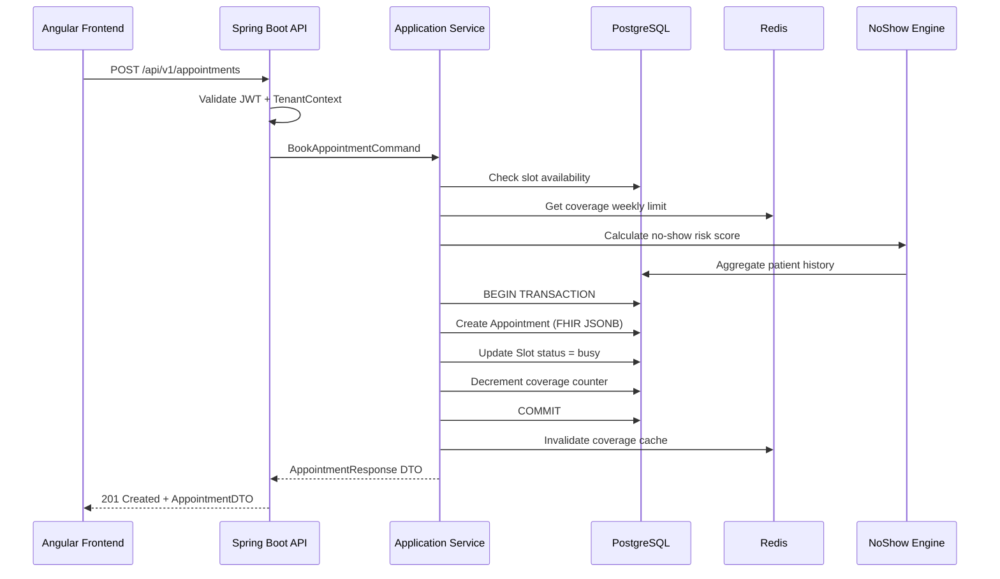

# High-Level Architecture — ClinicaSaaS

> Stack: Java 21 · Spring Boot 3.x · Spring Security · Spring Data JPA ·
> PostgreSQL 16 · Redis 8 · Angular 18 · Docker / Docker Compose

---

## 1. System Overview

ClinicaSaaS is a multitenant SaaS platform implementing FHIR R4 for small
clinics (1–5 professionals). Each tenant is a clinic; data isolation is
enforced via `tenant_id` column-level filtering (row-level multitenancy).

### Deployment Topology

```
Internet
    │
    ▼
┌─────────────────────────────────────────────────────┐
│  Nginx (reverse proxy + SSL termination)            │
│  Port 443/80                                        │
└──────────────┬──────────────────────┬───────────────┘
               │                      │
               ▼                      ▼
    ┌──────────────────┐   ┌──────────────────────┐
    │  Angular SPA      │   │  Spring Boot API      │
    │  Nginx static     │   │  Port 8080            │
    │  Port 4200 (dev)  │   │  /api/v1/**           │
    └──────────────────┘   │  /fhir/R4/**          │
                            └──────┬───────┬────────┘
                                   │       │
                          ┌────────▼┐   ┌──▼──────┐
                          │PostgreSQL│   │  Redis   │
                          │Port 5432 │   │Port 6379 │
                          └──────────┘   └──────────┘
```

---

## 2. Frontend Architecture (Angular 18)

```
src/
├── app/
│   ├── core/                  # Singleton services: auth, interceptors, guards
│   │   ├── auth/
│   │   ├── interceptors/
│   │   └── guards/
│   ├── shared/                # Reusable components, directives, pipes, models
│   │   ├── components/
│   │   ├── directives/
│   │   ├── pipes/
│   │   └── models/
│   ├── features/              # Feature modules (lazy-loaded)
│   │   ├── landing/
│   │   ├── login/
│   │   ├── select-tenant/
│   │   ├── agenda/
│   │   ├── patients/
│   │   ├── clinical/
│   │   ├── reports/
│   │   └── settings/
│   └── layout/                # Shell components: navbar, sidebar, footer
├── environments/
└── assets/
```

**Key patterns:**
- Lazy-loaded feature modules — one `routes` file per feature
- Standalone components (Angular 15+) preferred over NgModules
- Signal-based state management (Angular 17+ Signals)
- HTTP client via generated API services (one per backend controller)
- `AuthInterceptor` attaches Bearer token to every request
- `TenantInterceptor` attaches `X-Tenant-ID` header (informational/tracing only —
  the authoritative tenant source is the `tenant_id` claim in the JWT, see §6)
- `AuthGuard` requires auth state `READY` (two-step flow, ADR-014); `RoleGuard` for RBAC

---

## 3. Backend Architecture (Spring Boot 3)

> **Estructura objetivo (diseño)** — the current backend contains only the
> scaffold (`ClinicaSaasApplication` + `SecurityConfig`). The packages below
> are created incrementally as tasks T-003+ are implemented; they are a design
> target, not an inventory of existing code.

```
com.clinicasaas/
├── config/                    # Spring configuration classes
│   ├── SecurityConfig.java
│   ├── RedisConfig.java
│   ├── JpaConfig.java
│   └── OpenApiConfig.java
├── domain/                    # Domain entities (JPA), value objects, enums
│   ├── tenant/
│   ├── user/
│   ├── patient/
│   ├── appointment/
│   ├── encounter/
│   └── fhir/
├── application/               # Use cases / application services
│   ├── auth/
│   ├── agenda/
│   ├── clinical/
│   └── intelligence/
├── infrastructure/            # Adapters: repositories, external services, jobs
│   ├── persistence/
│   ├── cache/
│   ├── notifications/
│   └── fhir/
└── api/                       # Controllers, DTOs, exception handlers
    ├── v1/
    ├── fhir/
    └── exception/
```

**Clean Architecture layers (outside → inside):**
```
API layer          → DTOs, Controllers, Request/Response mapping
Application layer  → Use cases, Application services, command/query objects
Domain layer       → Entities, Domain services, Value objects, Repository interfaces
Infrastructure     → JPA repositories, Redis adapters, external HTTP clients
```

---

## 4. Database Architecture (PostgreSQL 16)

### Multitenant Strategy: Row-Level (Shared Schema)

Every table that holds tenant data includes a `tenant_id UUID NOT NULL` column.
A Spring `TenantContext` ThreadLocal stores the current tenant for each request;
the `TenantAwareRepository` base automatically appends `WHERE tenant_id = ?`.

```
┌─────────────────────────────────────────────┐
│               PostgreSQL Database            │
│  ┌──────────────────────────────────────┐   │
│  │  tenants (registry table)            │   │
│  └──────────────────────────────────────┘   │
│  ┌──────────────────────────────────────┐   │
│  │  users  (tenant_id FK → tenants.id)  │   │
│  └──────────────────────────────────────┘   │
│  ┌──────────────────────────────────────┐   │
│  │  fhir_resources  (JSONB + tenant_id) │   │
│  └──────────────────────────────────────┘   │
│  ┌──────────────────────────────────────┐   │
│  │  appointments (tenant_id + indexes)  │   │
│  └──────────────────────────────────────┘   │
└─────────────────────────────────────────────┘
```

### FHIR Storage

- FHIR resources stored as JSONB in `fhir_resources` (generic store)
- Queryable search parameters extracted into `fhir_search_params` (relational)
- Domain-critical attributes duplicated into typed columns for JOIN performance
- Migrations managed exclusively by **Flyway**

---

## 5. Cache Architecture (Redis 8)

```
┌────────────────────────────────────────────────────────────┐
│                          Redis                              │
│                                                             │
│  clinica:{tenantId}:perms:{userId}                TTL 5 min │
│  clinica:{tenantId}:coverage:{patientId}:{isoWeek}  TTL 1 h │
│  clinica:{tenantId}:noshow:{appointmentId}       TTL 30 min │
│  clinica:jti:{jti}             (JWT blocklist)  TTL = token │
│  clinica:ratelimit:login:{ip}  (login throttle)    TTL 60 s │
└────────────────────────────────────────────────────────────┘
```

Key naming follows `docs/standards/04-redis-standards.md`
(`clinica:` prefix always; `tenantId` on every tenant-scoped key).

Redis is used only for:
1. RBAC permission cache per user per tenant
2. Insurance coverage weekly limit counters
3. No-show risk score cache per appointment
4. JWT revocation list (blocklist by JTI — logout, switch-tenant,
   single-use identity tokens)
5. Login rate limiting (5 req/min per IP, T-003)

Redis is **never** used as primary storage. If Redis is unavailable,
the system falls back to the database and continues operating.

---

## 6. Security Architecture

### Two-step authentication flow (ADR-014)

```
Browser (Angular SPA)
    │
    │  1. POST /api/v1/auth/login { email, password }
    │     ← identityToken (JWT 5 min, purpose=tenant-select) + tenants list
    │  2. POST /api/v1/auth/select-tenant { tenantId }   Bearer <identityToken>
    │     ← accessToken (JWT 30 min; claims: sub, tenant_id, role, jti)
    │       + Set-Cookie: refreshToken (httpOnly, Secure, SameSite=Strict,
    │         Path=/api/v1/auth, 7 d)
    │  3. GET /api/v1/... (Authorization: Bearer <accessToken>)
    │
    ▼
Spring Security Filter Chain
    │
    ├── RateLimitFilter          — login only: 5 req/min per IP (Redis counter)
    ├── JwtAuthenticationFilter  — validates signature + expiry, checks JTI against
    │                              Redis blocklist, populates SecurityContext
    ├── TenantContextFilter      — reads tenant_id from SecurityContext, sets ThreadLocal
    └── AuthorizationFilter      — checks @PreAuthorize / method security
```

- Single-tenant users skip step 2 in the UI: the frontend auto-selects the tenant.
- Identity tokens are single-use: their JTI is blocklisted after `select-tenant`.
- `POST /api/v1/auth/switch-tenant` issues an accessToken for another tenant
  without re-login; the previous JTI is blocklisted and the refresh cookie rotated.
- `POST /api/v1/auth/refresh` authenticates via the httpOnly cookie (single-use
  rotation; reuse revokes the whole token family). The refresh session is per tenant.
- Public endpoints: only `POST /api/v1/auth/login`, `POST /api/v1/auth/select-tenant`,
  `POST /api/v1/auth/refresh` and `GET /actuator/health` — everything else requires
  a valid accessToken.

- **Authentication**: JWT (JJWT library), stateless, two-step
  (identity token → session token, ADR-014)
- **Authorization**: `role` claim in JWT + permissions in Redis cache via
  Spring Security `@PreAuthorize` (RBAC, T-004)
- **Multitenancy**: `tenant_id` claim set at select-tenant; validated on every request
- **Refresh tokens**: stored as SHA-256 hash in PostgreSQL; single-use rotation
- **Token revocation**: JTI blocklist in Redis (`clinica:jti:{jti}`)
- **Passwords**: BCrypt (strength 12)
- **Secrets**: environment variables only; never committed

---

## 7. Deployment Architecture

```
docker-compose.yml
├── nginx       — reverse proxy, SSL termination (Let's Encrypt / Certbot)
├── frontend    — Angular build served by Nginx static
├── backend     — Spring Boot JAR, runs Flyway migrations on startup
├── postgres    — PostgreSQL 16, data volume, not exposed externally
└── redis       — Redis 8, password-protected, not exposed externally
```

### Container Resource Limits (VPS 4GB RAM)

| Service | Memory Limit | Notes |
|---|---|---|
| backend | 800 MB | Spring Boot + JVM, G1GC |
| frontend | 64 MB | Static Nginx serving |
| postgres | 512 MB | shared_buffers = 128MB |
| redis | 128 MB | maxmemory-policy allkeys-lru |
| nginx | 32 MB | Proxy only |

### Health Checks

- Backend: `GET /actuator/health`
- Database: `pg_isready`
- Redis: `PING`

---

## 8. Component Interaction Diagram (UC-01: Book Appointment)


