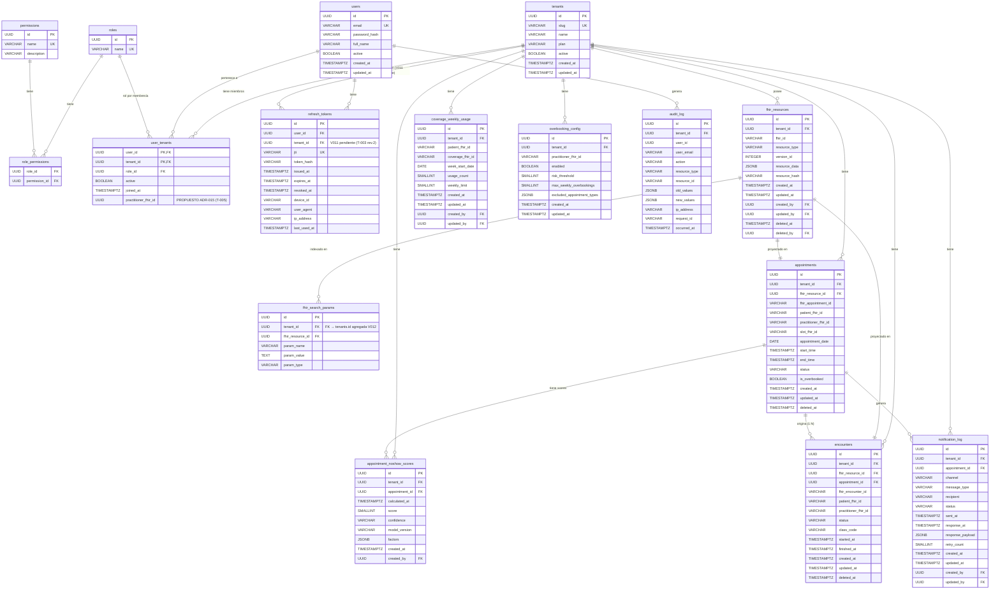

# Specification: Database Schema — ClinicaSaaS MVP

**Status**: APPROVED — v5
**Author**: Julián Deco
**Date**: 2026-06-08 (última revisión: 2026-06-10)
**Task**: T-001 (`tasks.json`)
**Branch**: `feature/T-001-scaffold-backend`
**Relates to**: transversal (UC-01, UC-02, UC-03, UC-04)
**ADRs referenced**: ADR-002, ADR-003, ADR-008, ADR-009, ADR-014, ADR-015 (PROPOSED)

## Changelog

| Versión | Fecha | Cambios |
|---|---|---|
| v3 | 2026-06-08 | APPROVED — post correcciones de consistencia |
| v4 | 2026-06-10 | Sync con ADR-014 (V010: `users` global, `user_tenants`, drop `user_roles`), ADR-015 (`practitioner_fhir_id` PROPOSED) y spec T-003 rev.2 (V011: `refresh_tokens.tenant_id`, pendiente de implementación). OQ-07/OQ-08 marcadas como supersedidas por ADR-014. |
| v5 | 2026-06-15 | V012: corrección de columnas de auditoría faltantes detectadas en análisis DER. `appointment_noshow_scores` agrega `created_by`; `coverage_weekly_usage` agrega `created_at`, `created_by`, `updated_by` y trigger; `notification_log` agrega `updated_at` (con trigger), `created_by`, `updated_by`; `fhir_search_params` agrega FK constraint explícita a `tenants`. OQ-09 actualizada. §7 y §8 sincronizados. |

---

## 1. Business Goal

Definir el esquema completo de base de datos PostgreSQL para el MVP del
seminario. El esquema debe soportar los 4 casos de uso ICONIX (CU-01 a
CU-04), la arquitectura multitenant row-level (ADR-003), el storage FHIR
JSONB (ADR-009), el sistema de autenticación JWT con auditoría (ADR-006),
y el RBAC dinámico con permisos en BD (T-004).

Este documento es la fuente de verdad para todas las migraciones Flyway
del MVP. Ninguna migración se escribe sin que este spec esté en APPROVED.

---

## 2. Decisiones de diseño confirmadas (OQ resueltas)

### OQ-01 — Separación users / patients
`users` = personal interno (ADMIN, DOCTOR, SECRETARY) únicamente.
`Patient` vive en `fhir_resources` (JSONB). No hay tabla `patients`
relacional en el MVP. Si aparecen requisitos de reporting intensivo,
se crea una `patient_projection` derivada del FHIR en un ADR futuro.

### OQ-02 — refresh_tokens dual (Redis + PostgreSQL)
Redis es fuente de verdad para validación online y JTI blocklist (TTL
automático). PostgreSQL almacena `refresh_tokens` para auditoría,
trazabilidad e investigación de incidentes. Ambos son necesarios;
Redis no puede ser la única persistencia para autenticación.

### OQ-03 — coverage_weekly_usage: semana calendario
Semana = lunes 00:00 → domingo 23:59 (ISO 8601).
`week_start_date DATE` es parte de la clave lógica.
Clave: `(patient_fhir_id, coverage_fhir_id, tenant_id, week_start_date)`.

### OQ-04 — appointment_noshow_scores: tabla separada
`appointments` queda liviana. `appointment_noshow_scores` almacena
score actual + histórico de recálculos + factores JSONB + versión del
modelo. Permite cambiar el algoritmo sin tocar la entidad principal.

### OQ-05 — Permisos RBAC en PostgreSQL
PostgreSQL es fuente de verdad. Tablas `permissions` y `role_permissions`
en la migración de usuarios. Redis cachea permisos por rol con TTL 5min.
No hardcodear permisos — los roles son estables pero los permisos crecen.

### OQ-06 — Un única tabla fhir_resources
Todos los resource types (Patient, Practitioner, Appointment, Encounter,
Observation, Coverage, Communication, Schedule, Slot) conviven en una
única tabla `fhir_resources` con `(tenant_id, resource_type, fhir_id)`
como clave lógica. Patrón idéntico a HAPI FHIR (HFJ_RESOURCE + HFJ_RES_VER)
y Smile CDR. `fhir_search_params` para búsquedas indexadas.

### OQ-07 — Multitenancy: roles/permissions globales (Opción A)
> ⚠️ **Parcialmente supersedida por ADR-014 (V010, 2026-06-09).**
> `roles`, `permissions`, `role_permissions` siguen siendo globales (vigente),
> pero `user_roles` fue eliminada: el rol se asigna por membresía en
> `user_tenants.role_id` (un rol por usuario por tenant). Ver §5 Grupo B.

Texto original (histórico):
`roles`, `permissions`, `role_permissions` son tablas globales (sin `tenant_id`).
`user_roles` hereda el scope del usuario (que sí tiene `tenant_id`).
Justificación: MVP SaaS médico con roles fijos — ADMIN, DOCTOR, SECRETARY.
Si se requiere personalización de roles por clínica, se agrega `tenant_id`
en una migración futura con ADR.

### OQ-08 — users: UNIQUE global por email
> ⚠️ **Supersedida en parte por ADR-014 (V010, 2026-06-09).**
> El `UNIQUE(email)` global se mantiene (vigente y reforzado: `users` es ahora
> identidad global). Lo que quedó invalidado es "un usuario pertenece a un
> solo tenant": con ADR-014 un usuario puede pertenecer a N tenants vía la
> tabla pivote `user_tenants`. La "nueva migración + ADR" anticipada aquí
> es exactamente ADR-014 + V010.

Texto original (histórico):
`UNIQUE(email)` global, no `UNIQUE(email, tenant_id)`.
Justificación: simplifica login (el usuario identifica su tenant por slug
o al momento del onboarding). Un usuario pertenece a un solo tenant en MVP.
Si se requiere staff multi-tenant, nueva migración + ADR.

### OQ-09 — Soft delete: política explícita
Soft delete **sí** (tienen `deleted_at`, `deleted_by`):
`appointments`, `encounters`, `fhir_resources`, `overbooking_config`.
Soft delete **no** (registros históricos, DELETE físico permitido):
`coverage_weekly_usage`, `appointment_noshow_scores`, `notification_log`, `refresh_tokens`.

Nota (v5): las tablas sin soft delete igualmente cumplen el estándar §2 de columnas
de auditoría (`created_at`, `updated_at`, `created_by`, `updated_by`) según corresponda.
V012 corrigió los faltantes en `coverage_weekly_usage`, `appointment_noshow_scores` y
`notification_log`. La ausencia de `deleted_at`/`deleted_by` es intencional —
no contradice el requisito de columnas de trazabilidad.

### OQ-10 — Appointment → Encounter: relación 1:N
FK `encounters.appointment_id` sin UNIQUE — un Appointment puede originar
múltiples Encounters (reingresos, atención dividida, walk-in).
El diagrama actualiza de `||--||` a `||--o{`.

### OQ-12 — Módulos opcionales por tenant: JSONB en tenants (no tabla separada)
Módulos activables/desactivables por tenant vía campo `enabled_modules JSONB`
en la tabla `tenants`. El administrador los modifica directamente en BD por ahora.
No se crea tabla `tenant_modules` en el MVP — sería over-engineering para 1 piloto.
Cuando haya panel de admin y múltiples tenants, se migra a tabla separada con ADR.

Módulos válidos del MVP:
```
APPOINTMENTS        — Agenda, turnos, slots (siempre activo — núcleo)
ENCOUNTERS          — Historia clínica SOAP (siempre activo — núcleo)
FHIR_COVERAGE       — Obra social y tope semanal
NOSHOW_PREDICTION   — Motor heurístico de ausentismo
NOTIFICATIONS       — Recordatorios inteligentes por canal
OVERBOOKING         — Sobreturnos inteligentes
```

El `ModuleGuard` en application layer consulta `tenants.enabled_modules` (cacheado
en Redis TTL 5min) antes de ejecutar cualquier use case de módulo opcional.

### OQ-11 — resource_hash en fhir_resources
Agregar `resource_hash VARCHAR(64)` (SHA-256 del `resource_data`).
Permite detectar cambios sin comparar JSONB completo, evitar escrituras
innecesarias y auditar versiones.

---

## 3. Functional Requirements

- FR-01: Toda tabla de datos de negocio debe incluir `tenant_id UUID NOT NULL`
  referenciando `tenants(id)`. Excepción: `users` es identidad global sin
  `tenant_id` desde V010 (ADR-014) — la membresía vive en `user_tenants` (§5 Grupo B).
- FR-02: Toda tabla tenant-scoped debe incluir `created_at` y `updated_at`.
  Las entidades sujetas a soft delete deben además incluir `deleted_at` y `deleted_by`.
  Las entidades auditables deben incluir `created_by` y `updated_by` según corresponda.
  Las excepciones están documentadas explícitamente en OQ-09 de este spec.
- FR-03: `updated_at` se mantiene con trigger `set_updated_at()` reutilizable —
  no depender del código de aplicación.
- FR-04: PKs son UUID generados con `gen_random_uuid()`.
- FR-05: `fhir_resources` almacena el JSON completo del recurso FHIR R4 en
  columna `resource_data JSONB`. Índice GIN obligatorio.
- FR-06: `fhir_search_params` extrae parámetros de búsqueda del JSONB para
  evitar full-scans.
- FR-07: `appointments` duplica columnas críticas del FHIR Appointment
  (`appointment_date`, `status`, `patient_fhir_id`, `practitioner_fhir_id`)
  para JOINs eficientes sin tocar JSONB.
- FR-08: `refresh_tokens` en PostgreSQL persiste tokens para auditoría;
  `revoked_at` permite trazabilidad de revocaciones.
- FR-09: `permissions` y `role_permissions` en PostgreSQL son fuente de
  verdad para RBAC; Redis cachea TTL 5min.
- FR-10: `coverage_weekly_usage` usa `week_start_date` (lunes de la semana
  ISO) como parte de la clave de unicidad.
- FR-11: `appointment_noshow_scores` registra score, factores JSONB y versión
  del modelo; permite múltiples scores por turno (historial de recálculos).
- FR-12: `overbooking_config` configura el motor UC-04 por profesional:
  habilitado, umbral de riesgo, tope semanal, tipos de turno excluidos.
- FR-13: `notification_log` registra cada intento de notificación: canal,
  tipo de mensaje, estado, timestamp, respuesta del paciente si llega.
- FR-14: `fhir_resources` incluye `resource_hash CHAR(64) NOT NULL` (SHA-256 hex,
  siempre 64 caracteres) para detección eficiente de cambios sin comparar JSONB.
- FR-15: `refresh_tokens` incluye `device_id`, `user_agent` y `last_used_at`
  para auditoría de sesiones y detección de uso anómalo.
- FR-16: `appointment_noshow_scores` tiene índice en `(appointment_id, calculated_at DESC)`
  para recuperar el score vigente (más reciente) en una sola lectura.
- FR-17: `encounters.patient_fhir_id` y `encounters.practitioner_fhir_id` son
  columnas de proyección denormalizadas para queries de agenda — no reemplazan
  la relación con `appointments`.
- FR-18: `audit_log` registra toda acción significativa sobre datos de negocio:
  CREATE, UPDATE, DELETE, LOGIN, LOGOUT, FAILED_LOGIN, PERMISSION_DENIED,
  TOKEN_REVOKED. Solo INSERT — nunca UPDATE ni DELETE sobre esta tabla.
- FR-19: `audit_log.old_values` y `audit_log.new_values` capturan el estado
  JSONB antes y después de la modificación para trazabilidad completa.
- FR-20: `tenants.enabled_modules JSONB` lista los módulos activos para ese
  tenant. `APPOINTMENTS` y `ENCOUNTERS` siempre presentes. El `ModuleGuard`
  en application layer verifica este campo (vía cache Redis TTL 5min) antes
  de ejecutar cualquier use case de módulo opcional.
- FR-21: `permissions.module` agrupa cada permiso por módulo de negocio.
  Permite filtrar permisos irrelevantes en el panel de admin cuando un módulo
  está deshabilitado para el tenant.

---

## 4. Non-Functional Requirements

- NFR-01: Toda query de negocio incluye `WHERE tenant_id = ?` — verificado en
  código review y test de aislamiento de tenant por repositorio.
- NFR-02: Índice `idx_{table}_tenant_id` en toda tabla con `tenant_id`.
- NFR-03: Índice GIN en `fhir_resources.resource_data` para búsquedas JSONB.
- NFR-04: Índice compuesto en `appointments(tenant_id, appointment_date)` —
  patrón de acceso principal de agenda.
- NFR-05: `pg_crypto` habilitado para `gen_random_uuid()`.
- NFR-06: Timestamps siempre `TIMESTAMPTZ` — nunca `TIMESTAMP` sin zona.
- NFR-07: Flyway es el único mecanismo de migraciones — nunca `ddl-auto`.
- NFR-08: Migraciones idempotentes donde sea posible (`IF NOT EXISTS`).
- NFR-09: `audit_log` tiene índice en `(tenant_id, occurred_at DESC)` para
  consultas de auditoría paginadas por clínica.
- NFR-10: `audit_log` tiene índice en `(tenant_id, user_id, occurred_at DESC)`
  para trazabilidad de acciones por usuario.
- NFR-11: `audit_log` nunca se modifica — se garantiza con REVOKE UPDATE/DELETE
  sobre el rol de aplicación en PostgreSQL (post-MVP).

---

## 5. Tablas por grupo y migración

### Grupo A — Infraestructura SaaS (sin tenant_id — datos globales)

#### `tenants`
| Columna | Tipo | Restricción |
|---|---|---|
| id | UUID | PK, `gen_random_uuid()` |
| slug | VARCHAR(63) | NOT NULL, UNIQUE — identificador URL-friendly |
| name | VARCHAR(255) | NOT NULL |
| plan | VARCHAR(50) | NOT NULL DEFAULT 'free' |
| active | BOOLEAN | NOT NULL DEFAULT TRUE |
| enabled_modules | JSONB | NOT NULL DEFAULT '["APPOINTMENTS","ENCOUNTERS"]' — módulos activos (OQ-12) |
| created_at | TIMESTAMPTZ | NOT NULL DEFAULT NOW() |
| updated_at | TIMESTAMPTZ | NOT NULL DEFAULT NOW() |

Módulos válidos: `APPOINTMENTS`, `ENCOUNTERS`, `FHIR_COVERAGE`,
`NOSHOW_PREDICTION`, `NOTIFICATIONS`, `OVERBOOKING`.
`APPOINTMENTS` y `ENCOUNTERS` siempre presentes — son el núcleo del sistema.

#### `roles`
| Columna | Tipo | Restricción |
|---|---|---|
| id | UUID | PK |
| name | VARCHAR(50) | NOT NULL, UNIQUE — ADMIN, DOCTOR, SECRETARY |

Seed: `INSERT INTO roles(name) VALUES ('ADMIN'),('DOCTOR'),('SECRETARY')`.

#### `permissions`
| Columna | Tipo | Restricción |
|---|---|---|
| id | UUID | PK |
| name | VARCHAR(100) | NOT NULL, UNIQUE — e.g. APPOINTMENT_CREATE |
| module | VARCHAR(50) | NOT NULL — agrupación semántica (OQ-12) |
| description | VARCHAR(255) | |

`module` vincula cada permiso a su módulo correspondiente. Permite filtrar
permisos irrelevantes cuando un módulo está deshabilitado para un tenant.

Seed: ver sección 6.

#### `role_permissions`
| Columna | Tipo | Restricción |
|---|---|---|
| role_id | UUID | FK → roles(id) ON DELETE CASCADE |
| permission_id | UUID | FK → permissions(id) ON DELETE CASCADE |
| PK | — | (role_id, permission_id) |

---

### Grupo B — Usuarios y auth (identidad global + membresía por tenant)

> ⚠️ **Refactor V010 (ADR-014, 2026-06-09)**: `users` dejó de ser tenant-scoped
> y pasó a ser **identidad global** (sin `tenant_id`). La pertenencia a clínicas
> se modela en la tabla pivote `user_tenants` (un usuario × N tenants, un rol
> por tenant). `user_roles` fue eliminada. Excepción explícita a FR-01:
> `users` y `user_tenants` no son "datos de negocio tenant-scoped" — `users` es
> global y `user_tenants` lleva `tenant_id` como parte de su PK.

#### `users`

Identidad global del sistema (ADR-014, V010). **No tiene `tenant_id`** —
la columna y su FK fueron eliminadas en `V010__refactor_users_multi_tenant.sql`.
`email` mantiene unicidad global (`uq_users_email`): una cuenta por persona real.

| Columna | Tipo | Restricción |
|---|---|---|
| id | UUID | PK |
| email | VARCHAR(255) | NOT NULL, UNIQUE — global (OQ-08, reafirmado por ADR-014) |
| password_hash | VARCHAR(255) | NOT NULL — BCrypt |
| full_name | VARCHAR(255) | NOT NULL |
| active | BOOLEAN | NOT NULL DEFAULT TRUE |
| created_at | TIMESTAMPTZ | NOT NULL DEFAULT NOW() |
| updated_at | TIMESTAMPTZ | NOT NULL DEFAULT NOW() |
| created_by | UUID | FK → users(id) — admin que creó el usuario |
| updated_by | UUID | FK → users(id) |

#### `user_tenants`

Membresía usuario × tenant (ADR-014, creada en V010). Reemplaza a `user_roles`:
un usuario tiene **exactamente un rol por tenant** (MVP; extender post-MVP si
se necesitan roles múltiples por tenant).

| Columna | Tipo | Restricción |
|---|---|---|
| user_id | UUID | NOT NULL, FK → users(id) ON DELETE CASCADE (`fk_ut_user`) |
| tenant_id | UUID | NOT NULL, FK → tenants(id) ON DELETE CASCADE (`fk_ut_tenant`) |
| role_id | UUID | NOT NULL, FK → roles(id) (`fk_ut_role`) |
| active | BOOLEAN | NOT NULL DEFAULT TRUE — membresía activable/desactivable |
| joined_at | TIMESTAMPTZ | NOT NULL DEFAULT NOW() |
| PK | — | (user_id, tenant_id) (`pk_user_tenants`) |

Índices: `idx_user_tenants_user_id (user_id)`, `idx_user_tenants_tenant_id (tenant_id)`.

DDL (según V010):

```sql
CREATE TABLE IF NOT EXISTS user_tenants (
    user_id   UUID        NOT NULL,
    tenant_id UUID        NOT NULL,
    role_id   UUID        NOT NULL,
    active    BOOLEAN     NOT NULL DEFAULT TRUE,
    joined_at TIMESTAMPTZ NOT NULL DEFAULT NOW(),

    CONSTRAINT pk_user_tenants PRIMARY KEY (user_id, tenant_id),
    CONSTRAINT fk_ut_user      FOREIGN KEY (user_id)   REFERENCES users(id)   ON DELETE CASCADE,
    CONSTRAINT fk_ut_tenant    FOREIGN KEY (tenant_id) REFERENCES tenants(id) ON DELETE CASCADE,
    CONSTRAINT fk_ut_role      FOREIGN KEY (role_id)   REFERENCES roles(id)
);
```

**PROPUESTO — ADR-015 (status PROPOSED, pendiente aprobación @julian)**:
columna `practitioner_fhir_id UUID NULL` en `user_tenants` para vincular la
membresía con el recurso `Practitioner` FHIR del tenant ("usuario actúa como
profesional", por clínica). FK **lógica** hacia `fhir_resources.id` validada en
capa de aplicación (no FK física). NULL para usuarios no clínicos
(SECRETARY, ADMIN). La migración se implementa junto con T-005 (V012 o
siguiente disponible) — **no existe aún en el esquema**.

#### `user_roles` — ELIMINADA (V010)

> ⚠️ **Deprecada y eliminada** en `V010__refactor_users_multi_tenant.sql`
> (`DROP TABLE IF EXISTS user_roles`). El rol del usuario se asigna ahora por
> membresía en `user_tenants.role_id` (ADR-014). Esta entrada se conserva solo
> como nota histórica — no recrear.

#### `refresh_tokens`

> 📌 **Cambio pendiente — V011 (definida en spec T-003 rev.2, pendiente de
> implementación)**: `ALTER TABLE refresh_tokens ADD COLUMN tenant_id UUID
> NOT NULL REFERENCES tenants(id)`. La sesión de refresh es **por tenant**:
> sin esta columna, `POST /auth/refresh` no sabe para qué tenant emitir el
> nuevo accessToken (con ADR-014 el usuario puede pertenecer a N tenants).
> Nota: V010 afirmaba "sin cambios necesarios" en `refresh_tokens`; esa
> afirmación quedó corregida por el spec T-003 rev.2.

| Columna | Tipo | Restricción |
|---|---|---|
| id | UUID | PK |
| user_id | UUID | NOT NULL, FK → users(id) ON DELETE CASCADE |
| tenant_id | UUID | NOT NULL, FK → tenants(id) — **V011 pendiente de implementación (T-003 rev.2)** |
| jti | VARCHAR(36) | NOT NULL, UNIQUE — JWT ID del token |
| token_hash | VARCHAR(255) | NOT NULL — SHA-256 del refresh token |
| issued_at | TIMESTAMPTZ | NOT NULL |
| expires_at | TIMESTAMPTZ | NOT NULL |
| revoked_at | TIMESTAMPTZ | NULL = activo |
| revocation_reason | VARCHAR(100) | NULL |
| device_id | VARCHAR(255) | — fingerprint del dispositivo |
| user_agent | VARCHAR(500) | |
| ip_address | VARCHAR(45) | — IPv4/IPv6 |
| last_used_at | TIMESTAMPTZ | — actualizado en cada refresh exitoso |

Nota: DELETE físico permitido en esta tabla para tokens expirados
(job de purga). El soft delete no aplica aquí (OQ-09).

---

### Grupo C — FHIR storage (tenant-scoped)

#### `fhir_resources`
Patrón validado por HAPI FHIR (HFJ_RESOURCE+HFJ_RES_VER) y Smile CDR.

| Columna | Tipo | Restricción |
|---|---|---|
| id | UUID | PK |
| tenant_id | UUID | NOT NULL, FK → tenants(id) |
| fhir_id | VARCHAR(64) | NOT NULL — FHIR logical ID |
| resource_type | VARCHAR(50) | NOT NULL — Patient, Appointment, etc. |
| version_id | INTEGER | NOT NULL DEFAULT 1 |
| resource_data | JSONB | NOT NULL — JSON completo del recurso FHIR R4 |
| resource_hash | CHAR(64) | NOT NULL — SHA-256 hex de resource_data (OQ-11) |
| created_at | TIMESTAMPTZ | NOT NULL DEFAULT NOW() |
| updated_at | TIMESTAMPTZ | NOT NULL DEFAULT NOW() |
| created_by | UUID | FK → users(id) |
| updated_by | UUID | FK → users(id) |
| deleted_at | TIMESTAMPTZ | — soft delete (OQ-09) |
| deleted_by | UUID | FK → users(id) |
| UNIQUE | — | (tenant_id, resource_type, fhir_id) |

Resource types en MVP: `Patient`, `Practitioner`, `Schedule`, `Slot`,
`Appointment`, `Encounter`, `Observation`, `Coverage`, `Communication`.

#### `fhir_search_params`
| Columna | Tipo | Restricción |
|---|---|---|
| id | UUID | PK |
| tenant_id | UUID | NOT NULL, FK → tenants(id) — constraint explícita agregada en V012 |
| fhir_resource_id | UUID | NOT NULL, FK → fhir_resources(id) ON DELETE CASCADE |
| param_name | VARCHAR(100) | NOT NULL — e.g. "family", "birthdate" |
| param_value | TEXT | NOT NULL |
| param_type | VARCHAR(20) | NOT NULL — string, token, date, reference |

---

### Grupo D — Dominio relacional de negocio (tenant-scoped)

Estas tablas duplican columnas críticas del FHIR para JOINs eficientes.

#### `appointments`

Duplica del FHIR Appointment los campos críticos de acceso frecuente.
El FHIR R4 Appointment tiene status: `proposed | pending | booked |
arrived | fulfilled | cancelled | noshow | entered-in-error |
checked-in | waitlist` (HL7 oficial).

| Columna | Tipo | Restricción |
|---|---|---|
| id | UUID | PK |
| tenant_id | UUID | NOT NULL, FK → tenants(id) |
| fhir_resource_id | UUID | NOT NULL, FK → fhir_resources(id) |
| fhir_appointment_id | VARCHAR(64) | NOT NULL — FHIR logical ID |
| UNIQUE | — | (tenant_id, fhir_appointment_id) — evita proyecciones duplicadas |
| patient_fhir_id | VARCHAR(64) | NOT NULL — ref a Patient en fhir_resources |
| practitioner_fhir_id | VARCHAR(64) | NOT NULL — ref a Practitioner |
| slot_fhir_id | VARCHAR(64) | NOT NULL — ref a Slot |
| appointment_date | DATE | NOT NULL |
| start_time | TIMESTAMPTZ | NOT NULL |
| end_time | TIMESTAMPTZ | NOT NULL |
| CHECK | — | end_time > start_time |
| status | VARCHAR(30) | NOT NULL — enum FHIR R4 |
| is_overbooked | BOOLEAN | NOT NULL DEFAULT FALSE |
| cancellation_reason | VARCHAR(255) | |
| created_at | TIMESTAMPTZ | NOT NULL DEFAULT NOW() |
| updated_at | TIMESTAMPTZ | NOT NULL DEFAULT NOW() |
| created_by | UUID | FK → users(id) |
| updated_by | UUID | FK → users(id) |
| deleted_at | TIMESTAMPTZ | |
| deleted_by | UUID | FK → users(id) |

#### `appointment_noshow_scores`

| Columna | Tipo | Restricción |
|---|---|---|
| id | UUID | PK |
| tenant_id | UUID | NOT NULL, FK → tenants(id) |
| appointment_id | UUID | NOT NULL, FK → appointments(id) |
| calculated_at | TIMESTAMPTZ | NOT NULL DEFAULT NOW() |
| score | SMALLINT | NOT NULL, CHECK (score BETWEEN 0 AND 100) |
| confidence | VARCHAR(10) | NOT NULL — 'high','medium','low' |
| model_version | VARCHAR(20) | NOT NULL — e.g. 'heuristic-v1' |
| factors | JSONB | NOT NULL — lista de factores explicables con valor y peso |
| created_at | TIMESTAMPTZ | NOT NULL DEFAULT NOW() — agregado en V012 |
| created_by | UUID | FK → users(id) — agregado en V012 |

Nota: múltiples filas por `appointment_id` permiten historial de
recálculos. El score vigente es el más reciente por `calculated_at`.
DELETE físico permitido (registro histórico — OQ-09).

Esquema documentado de `factors`:
```json
[{"factor": "no_show_history", "value": 3, "weight": 0.4, "label": "3 ausencias previas"},
 {"factor": "advance_days",    "value": 1, "weight": 0.3, "label": "Turno mañana"},
 {"factor": "time_slot",       "value": "08:00", "weight": 0.3, "label": "Horario temprano"}]
```

#### `coverage_weekly_usage`

Tope semanal de cobertura por paciente. Semana ISO: lunes 00:00 → domingo 23:59.

| Columna | Tipo | Restricción |
|---|---|---|
| id | UUID | PK |
| tenant_id | UUID | NOT NULL, FK → tenants(id) |
| patient_fhir_id | VARCHAR(64) | NOT NULL |
| coverage_fhir_id | VARCHAR(64) | NOT NULL — ref a Coverage FHIR |
| week_start_date | DATE | NOT NULL — siempre lunes |
| usage_count | SMALLINT | NOT NULL DEFAULT 0, CHECK (usage_count >= 0) |
| weekly_limit | SMALLINT | NOT NULL, CHECK (weekly_limit > 0) — copiado de Coverage al crear |
| created_at | TIMESTAMPTZ | NOT NULL DEFAULT NOW() — agregado en V012 |
| updated_at | TIMESTAMPTZ | NOT NULL DEFAULT NOW() |
| created_by | UUID | FK → users(id) — agregado en V012 |
| updated_by | UUID | FK → users(id) — agregado en V012 |
| UNIQUE | — | (tenant_id, patient_fhir_id, coverage_fhir_id, week_start_date) |

#### `encounters`

Duplica estado del FHIR Encounter para queries de agenda sin JSONB.
Estado FHIR R4: `planned → arrived → triaged → in-progress → onleave → finished | cancelled`.

| Columna | Tipo | Restricción |
|---|---|---|
| id | UUID | PK |
| tenant_id | UUID | NOT NULL, FK → tenants(id) |
| fhir_resource_id | UUID | NOT NULL, FK → fhir_resources(id) |
| fhir_encounter_id | VARCHAR(64) | NOT NULL |
| UNIQUE | — | (tenant_id, fhir_encounter_id) — evita proyecciones duplicadas |
| appointment_id | UUID | NOT NULL, FK → appointments(id) |
| patient_fhir_id | VARCHAR(64) | NOT NULL |
| practitioner_fhir_id | VARCHAR(64) | NOT NULL |
| status | VARCHAR(20) | NOT NULL — enum FHIR R4 |
| class_code | VARCHAR(20) | NOT NULL — AMB (ambulatorio) en MVP |
| started_at | TIMESTAMPTZ | |
| finished_at | TIMESTAMPTZ | |
| created_at | TIMESTAMPTZ | NOT NULL DEFAULT NOW() |
| updated_at | TIMESTAMPTZ | NOT NULL DEFAULT NOW() |
| created_by | UUID | FK → users(id) |
| updated_by | UUID | FK → users(id) |
| deleted_at | TIMESTAMPTZ | |
| deleted_by | UUID | FK → users(id) |

#### `overbooking_config`

Configuración del motor CU-04 por profesional. Soft delete sí (OQ-09).

| Columna | Tipo | Restricción |
|---|---|---|
| id | UUID | PK |
| tenant_id | UUID | NOT NULL, FK → tenants(id) |
| practitioner_fhir_id | VARCHAR(64) | NOT NULL |
| enabled | BOOLEAN | NOT NULL DEFAULT FALSE |
| risk_threshold | SMALLINT | NOT NULL DEFAULT 70, CHECK (risk_threshold BETWEEN 0 AND 100) |
| max_weekly_overbookings | SMALLINT | NOT NULL DEFAULT 5 |
| excluded_appointment_types | JSONB | DEFAULT '[]' — lista de códigos |
| created_at | TIMESTAMPTZ | NOT NULL DEFAULT NOW() |
| updated_at | TIMESTAMPTZ | NOT NULL DEFAULT NOW() |
| created_by | UUID | FK → users(id) |
| updated_by | UUID | FK → users(id) |
| deleted_at | TIMESTAMPTZ | — soft delete |
| deleted_by | UUID | FK → users(id) |
| UNIQUE | — | (tenant_id, practitioner_fhir_id) WHERE deleted_at IS NULL |

#### `notification_log`

Registro de envíos para CU-03. Una fila por intento de notificación.
DELETE físico permitido (registro histórico — OQ-09).

| Columna | Tipo | Restricción |
|---|---|---|
| id | UUID | PK |
| tenant_id | UUID | NOT NULL, FK → tenants(id) |
| appointment_id | UUID | NOT NULL, FK → appointments(id) |
| channel | VARCHAR(20) | NOT NULL — TELEGRAM, EMAIL, SMS |
| message_type | VARCHAR(20) | NOT NULL — REMINDER, CONFIRMATION, CANCELLATION, FOLLOW_UP |
| recipient | VARCHAR(255) | NOT NULL — teléfono o email |
| status | VARCHAR(20) | NOT NULL — PENDING, SENT, FAILED, CONFIRMED, CANCELLED |
| sent_at | TIMESTAMPTZ | |
| response_at | TIMESTAMPTZ | |
| response_payload | JSONB | — respuesta cruda del provider |
| retry_count | SMALLINT | NOT NULL DEFAULT 0 |
| error_message | TEXT | |
| created_at | TIMESTAMPTZ | NOT NULL DEFAULT NOW() |
| updated_at | TIMESTAMPTZ | NOT NULL DEFAULT NOW() — agregado en V012 |
| created_by | UUID | FK → users(id) — agregado en V012 |
| updated_by | UUID | FK → users(id) — agregado en V012 |

#### `audit_log`

Registro inmutable de toda acción significativa del usuario sobre datos
de negocio. Complementa los campos `created_by`/`updated_by`/`deleted_by`
con el contexto completo de la acción: quién, qué, cuándo, desde dónde,
y el estado anterior/posterior del recurso afectado.

Reglas:
- Solo INSERT — nunca UPDATE ni DELETE sobre esta tabla.
- Purga permitida para registros > 2 años (configurable por tenant).
- `tenant_id` tiene FK explícita a `tenants(id)` — cumple ADR-003 (OQ-09 revisado).

| Columna | Tipo | Restricción |
|---|---|---|
| id | UUID | PK |
| tenant_id | UUID | NOT NULL, FK → tenants(id) |
| user_id | UUID | NOT NULL — quién ejecutó la acción |
| user_email | VARCHAR(255) | NOT NULL — snapshot al momento de la acción |
| action | VARCHAR(50) | NOT NULL — CREATE, UPDATE, DELETE, LOGIN, LOGOUT, FAILED_LOGIN, PERMISSION_DENIED |
| resource_type | VARCHAR(100) | NOT NULL — e.g. Appointment, Encounter, User |
| resource_id | VARCHAR(64) | — ID del recurso afectado (NULL para acciones de auth) |
| old_values | JSONB | — estado anterior (NULL en CREATE) |
| new_values | JSONB | — estado posterior (NULL en DELETE) |
| ip_address | VARCHAR(45) | |
| user_agent | VARCHAR(500) | |
| request_id | VARCHAR(36) | — trace ID del request HTTP |
| occurred_at | TIMESTAMPTZ | NOT NULL DEFAULT NOW() |

Valores de `action`:

| Acción | Cuándo se registra |
|---|---|
| `CREATE` | Creación de cualquier entidad de negocio |
| `UPDATE` | Modificación de campos relevantes |
| `DELETE` | Soft delete o eliminación física |
| `LOGIN` | Login exitoso |
| `LOGOUT` | Logout explícito |
| `FAILED_LOGIN` | Intento de login fallido |
| `PERMISSION_DENIED` | Acceso a recurso sin permiso |
| `TOKEN_REVOKED` | Revocación de refresh token |

---

## 6. Seed de permisos iniciales (roles → permissions)

Formato: `PERMISO | módulo | roles`

```
-- Módulo APPOINTMENTS (núcleo)
APPOINTMENT_READ     | APPOINTMENTS | ADMIN, DOCTOR, SECRETARY
APPOINTMENT_CREATE   | APPOINTMENTS | ADMIN, SECRETARY
APPOINTMENT_UPDATE   | APPOINTMENTS | ADMIN, SECRETARY
APPOINTMENT_CANCEL   | APPOINTMENTS | ADMIN, SECRETARY

-- Módulo ENCOUNTERS (núcleo)
ENCOUNTER_READ       | ENCOUNTERS   | ADMIN, DOCTOR
ENCOUNTER_CREATE     | ENCOUNTERS   | ADMIN, DOCTOR
ENCOUNTER_UPDATE     | ENCOUNTERS   | ADMIN, DOCTOR
PATIENT_READ         | ENCOUNTERS   | ADMIN, DOCTOR, SECRETARY
PATIENT_CREATE       | ENCOUNTERS   | ADMIN, SECRETARY

-- Módulo FHIR_COVERAGE
COVERAGE_READ        | FHIR_COVERAGE | ADMIN, DOCTOR, SECRETARY
COVERAGE_UPDATE      | FHIR_COVERAGE | ADMIN

-- Módulo OVERBOOKING
OVERBOOKING_CONFIG   | OVERBOOKING  | ADMIN, DOCTOR

-- Módulo NOSHOW_PREDICTION
NOSHOW_SCORE_READ    | NOSHOW_PREDICTION | ADMIN, DOCTOR

-- Módulo NOTIFICATIONS
NOTIFICATION_READ    | NOTIFICATIONS | ADMIN

-- Sistema (sin módulo de negocio — siempre disponibles)
USER_MANAGE          | SYSTEM       | ADMIN
TENANT_CONFIG        | SYSTEM       | ADMIN
AUDIT_LOG_READ       | SYSTEM       | ADMIN
```

---

## 7. Plan de migraciones Flyway

| Migración | Contenido | Tablas |
|---|---|---|
| V001__create_tenants.sql | Función `set_updated_at()` + tabla `tenants` | tenants |
| V002__create_roles_and_permissions.sql | Roles, permisos, role_permissions + seed | roles, permissions, role_permissions |
| V003__create_users.sql | Users, user_roles, refresh_tokens (modelo original — refactorizado por V010) | users, user_roles, refresh_tokens |
| V004__create_fhir_resources.sql | FHIR storage + índices GIN | fhir_resources, fhir_search_params |
| V005__create_appointments.sql | Appointments + noshow scores + coverage | appointments, appointment_noshow_scores, coverage_weekly_usage |
| V006__create_encounters.sql | Encounters | encounters |
| V007__create_overbooking_config.sql | Config overbooking | overbooking_config |
| V008__create_notification_log.sql | Log de notificaciones | notification_log |
| V009__create_audit_log.sql | Auditoría de acciones de usuario | audit_log |
| V010__refactor_users_multi_tenant.sql | ADR-014: `users` global (drop `tenant_id`), crea `user_tenants`, drop `user_roles` | users, user_tenants, ~~user_roles~~ |
| V011__add_tenant_id_to_refresh_tokens.sql | `refresh_tokens.tenant_id UUID NOT NULL REFERENCES tenants(id)` — sesión de refresh por tenant | refresh_tokens |
| V012__fix_missing_audit_columns.sql | Corrección de columnas de auditoría faltantes: `created_by` en `appointment_noshow_scores`; `created_at/created_by/updated_by` + trigger en `coverage_weekly_usage`; `updated_at` (trigger) + `created_by/updated_by` en `notification_log`; FK explícita `tenant_id → tenants` en `fhir_search_params` | appointment_noshow_scores, coverage_weekly_usage, notification_log, fhir_search_params |
| V013 *(propuesta — ADR-015, se implementa en T-005)* | `user_tenants.practitioner_fhir_id UUID NULL` — FK lógica a Practitioner FHIR | user_tenants |

---

## 8. Diagrama entidad-relación (Mermaid)



---

## 9. Acceptance Criteria

- AC-01: La cadena de migraciones V001..V010 ejecuta sin errores en PostgreSQL 16
  limpio (V011 se valida en T-003; la migración de ADR-015 en T-005).
- AC-02: `GET /actuator/health` retorna `UP` con Flyway `status: success`.
- AC-03: Una fila en `appointments` con `tenant_id = T1` NO es visible con
  `tenant_id = T2` — test de aislamiento obligatorio.
- AC-04: `fhir_resources` acepta los 9 resource types del MVP sin cambio de schema.
- AC-05: `appointment_noshow_scores` acepta múltiples filas por `appointment_id`
  con distintos `calculated_at`.
- AC-06: `coverage_weekly_usage` rechaza duplicados en
  `(tenant_id, patient_fhir_id, coverage_fhir_id, week_start_date)`.
- AC-07: `overbooking_config` rechaza duplicados en `(tenant_id, practitioner_fhir_id)`.
- AC-08: Toda FK de negocio tiene índice explícito (verificable con
  `pg_indexes` + `information_schema`).
- AC-09: `audit_log` registra login exitoso con `action = 'LOGIN'`,
  `user_id`, `ip_address` y `occurred_at` correctos.
- AC-10: Un UPDATE sobre `appointments` genera fila en `audit_log` con
  `old_values` reflejando el estado previo y `new_values` el nuevo.
- AC-11: No existe ninguna sentencia UPDATE/DELETE sobre `audit_log`
  en el código de aplicación.
- AC-12: Un tenant con `enabled_modules = ["APPOINTMENTS","ENCOUNTERS"]`
  recibe HTTP 403 al intentar usar cualquier endpoint del módulo OVERBOOKING.
- AC-13: Modificar `enabled_modules` en BD e invalidar cache Redis activa
  el módulo en la siguiente request sin reiniciar el servidor.

---

## 10. Edge Cases

- EC-01: Paciente sin cobertura → `coverage_weekly_usage` no tiene fila → UC-01
  omite validación de tope sin error.
- EC-02: Score de no-show no calculado (motor caído) → `appointment_noshow_scores`
  no tiene fila para ese turno → UC-01 crea el turno sin score, registra para
  reintento.
- EC-03: Migración ejecutada en base ya inicializada → `IF NOT EXISTS` previene
  error; Flyway detecta checksum y no re-ejecuta.
- EC-04: Slot con `overbooked = true` en FHIR → `appointments.is_overbooked = true`
  en la tabla relacional.

---

## 11. Constraints

- Flyway es el único mecanismo de migraciones — nunca `ddl-auto=create/update`.
- Nunca modificar una migración ya commiteada — siempre agregar una nueva.
- Toda tabla con `deleted_at` usa `@Where(clause = "deleted_at IS NULL")` en JPA.
- `refresh_tokens` admite DELETE físico (purga de expirados) — excepción explícita
  al soft delete.
- Los campos `patient_fhir_id`, `practitioner_fhir_id`, etc. en tablas relacionales
  son VARCHAR referenciando el FHIR logical ID — no FK a `fhir_resources` para
  evitar complejidad en bulk imports futuros.

---

## 12. Dependencies

| Dependencia | Tipo | Notas |
|---|---|---|
| PostgreSQL 16 | Infraestructura | `gen_random_uuid()` requiere `pg_crypto` |
| Flyway 10.x | Framework | Incluido en `pom.xml` de T-001 |
| Spring Data JPA | Framework | Entidades JPA derivadas de este schema |
| ADR-003 | Arquitectura | Row-level multitenancy — `tenant_id` en todo |
| ADR-009 | Arquitectura | FHIR JSONB storage pattern |
| ADR-014 | Arquitectura | Identidad global + membresía `user_tenants` (V010) |
| ADR-015 (PROPOSED) | Arquitectura | `user_tenants.practitioner_fhir_id` — migración V013 en T-005 |
| T-003 (auth) | Tarea | Usa `users`, `user_tenants`, `refresh_tokens`; define V011 |
| T-004 (RBAC) | Tarea | Usa `roles`, `permissions`, `role_permissions`, `user_tenants.role_id` |
| T-005 (FHIR) | Tarea | Usa `fhir_resources`, `fhir_search_params`; implementa migración ADR-015 |
| T-006 (agenda) | Tarea | Usa `appointments`, `coverage_weekly_usage` |
| T-007 (historia) | Tarea | Usa `encounters` |
| T-008 (no-show) | Tarea | Usa `appointment_noshow_scores` |
| T-009 (notif.) | Tarea | Usa `notification_log` |
| T-010 (overbooking) | Tarea | Usa `overbooking_config` |

---

## 13. Risks

- R-01: Query sin `tenant_id` filtra datos cross-tenant — Mitigation: TenantAwareRepository
  base class + ítem explícito en checklist de code review.
- R-02: JSONB full-scan si se olvida usar `fhir_search_params` — Mitigation: EXPLAIN
  ANALYZE obligatorio para queries nuevas sobre `fhir_resources`.
- R-03: `coverage_weekly_usage` desincronizado si update no es atómico con creación
  del appointment — Mitigation: transacción única en UC-01 application service.
- R-04: Migración incorrecta en producción es irreversible (sin rollback automático
  en Flyway Community) — Mitigation: nota de rollback manual en cada PR que agregue
  migración.

---

## 14. Open Questions

Ninguna — todas las OQ (OQ-01 a OQ-12) fueron resueltas antes de escribir este spec.
Nota (v4): OQ-07 y OQ-08 fueron parcialmente supersedidas por ADR-014 — el texto
histórico se conserva en §2 con la anotación correspondiente.
