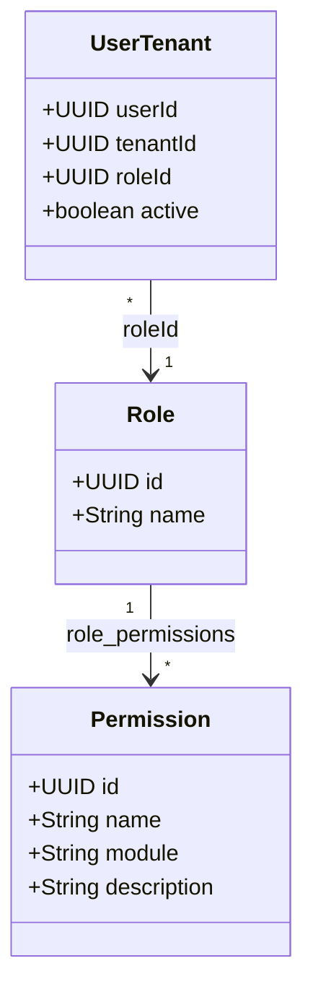

# Specification: RBAC — Verificación de Permisos

**Status**: APPROVED
**Author**: JulianDeco
**Date**: 2026-06-15
**Task**: T-004 (`tasks.json`)
**Branch**: `feature/T-004-rbac`
**Relates to**: transversal (prerequisito de CU-01 a CU-04)
**ADRs referenced**: ADR-003 (JWT híbrido), ADR-004 (Redis cache), ADR-006 (multitenant RLS)

---

## 1. Business Goal

Toda acción sensible del sistema (crear turno, abrir consulta, ver historia
clínica, configurar overbooking) debe estar protegida por un permiso
explícito. T-003 emite un JWT con el rol del usuario; T-004 construye la
capa que traduce ese rol en permisos verificables, usando Redis como caché
para minimizar consultas a BD en cada request.

Sin T-004 ningún endpoint de negocio puede aplicar control de acceso
granular — es el prerequisito transversal de CU-01 a CU-04.

---

## 2. Functional Requirements

- FR-01: El sistema debe exponer la entidad `Permission` (id, name, module,
  description) mapeada a la tabla `permissions` (V002).
- FR-02: El sistema debe proveer `PermissionRepository` (interfaz de dominio)
  con método `findNamesByRoleId(UUID roleId): List<String>`.
- FR-03: El sistema debe proveer `PermissionCachePort` (interfaz de aplicación)
  con operaciones `getPermissions`, `setPermissions`, `evictPermissions`.
- FR-04: El sistema debe implementar `PermissionCacheAdapter` (infra/cache)
  usando `StringRedisTemplate` con clave `clinica:perms:{tenantId}:{userId}`
  y TTL de 5 minutos.
- FR-05: El sistema debe proveer `PermissionService` (application) que,
  dado (tenantId, userId, roleId), retorne `Set<String>` de nombres de
  permiso: primero consulta caché Redis; si miss, consulta BD y puebla caché.
- FR-06: Los controllers deben declarar permisos requeridos con
  `@PreAuthorize("hasAuthority('PERMISSION_NAME')")` directamente.
  Spring Security no soporta meta-anotaciones con parámetros dinámicos.
- FR-07: Al cambiar el rol de un usuario en un tenant (asignación post-MVP),
  el sistema debe invalidar la entrada de caché correspondiente vía
  `PermissionCachePort.evictPermissions(tenantId, userId)`.
- FR-08: El `SecurityContextHolder` debe ser poblado con las authorities
  del usuario (permisos) en cada request autenticado, antes de que los
  controllers procesen la petición.

---

## 3. Non-Functional Requirements

- NFR-01: El tiempo de verificación de permiso (caché hit) debe ser < 5 ms.
- NFR-02: La clave Redis incluye siempre `tenantId` —
  `clinica:perms:{tenantId}:{userId}` — nunca solo `userId`.
- NFR-03: TTL de caché = 300 s (5 min), configurable vía
  `app.rbac.cache-ttl-seconds` en `application.yml`.
- NFR-04: Toda consulta a `permissions` y `role_permissions` filtra por
  `role_id` proveniente de `user_tenants` — nunca cross-tenant.
- NFR-05: La capa de dominio (`Permission`, `PermissionRepository`) no tiene
  dependencias de Spring más allá de anotaciones JPA.
- NFR-06: Cobertura de tests ≥ 80 % en las clases nuevas.

---

## 4. Acceptance Criteria

- AC-01: Dado un usuario DOCTOR con caché vacía, cuando se llama
  `PermissionService.getPermissions(tenantId, userId)`, entonces consulta BD,
  retorna los 8 permisos del rol DOCTOR y los almacena en Redis con TTL 300 s.
- AC-02: Dado un usuario DOCTOR con caché poblada, cuando se llama
  `PermissionService.getPermissions(tenantId, userId)`, entonces retorna los
  permisos desde Redis sin consultar BD (0 queries JPA).
- AC-03: Dado un usuario SECRETARY, cuando un endpoint decorado con
  `@RequiresPermission("ENCOUNTER_CREATE")` recibe su request, entonces
  Spring Security retorna 403 Forbidden.
- AC-04: Dado un usuario ADMIN, cuando un endpoint decorado con
  `@RequiresPermission("TENANT_CONFIG")` recibe su request, entonces
  retorna 200 OK.
- AC-05: Dado que se invalida la caché de un usuario (evict), cuando se llama
  `PermissionService.getPermissions(tenantId, userId)` nuevamente, entonces
  re-consulta BD y repuebla Redis.
- AC-06: Dado un request de tenant A con userId perteneciente a tenant B, cuando
  `PermissionService` resuelve permisos, entonces usa `role_id` de
  `user_tenants WHERE tenant_id = tenantIdA` — nunca filtra por el userId
  cruzando tenants.

---

## 5. Edge Cases

- EC-01: Usuario sin entrada en `user_tenants` para ese tenant →
  `getPermissions` retorna `Set.of()` (vacío, no error); el filtro de
  Spring Security deniega el acceso (403).
- EC-02: Rol sin permisos asignados en `role_permissions` →
  `getPermissions` retorna `Set.of()`; 403 en endpoints protegidos.
- EC-03: Redis no disponible (timeout) → `PermissionCacheAdapter` lanza
  `RedisConnectionFailureException`; `PermissionService` captura y hace
  fallback a BD; loguea WARN con detalle del error.
- EC-04: TTL expirado entre cache-set y cache-get (muy poco probable, pero
  teórico) → tratado como cache miss normal; BD vuelve a consultarse.
- EC-05: El mismo userId con roles distintos en dos tenants distintos →
  las claves Redis son independientes por tenantId — no hay colisión.

---

## 6. Constraints

- Las tablas `permissions`, `role_permissions` y `user_tenants` ya existen
  (V002 + V010) — no se genera migración nueva.
- El nombre del permiso en el JWT authority debe coincidir exactamente con
  `permissions.name` (e.g. `APPOINTMENT_CREATE`), en mayúsculas.
- No se implementa CRUD de roles/permisos en esta tarea — queda post-MVP.
- No se agrega el claim `permissions` al JWT — las authorities se resuelven
  en cada request desde Redis/BD para mantener revocabilidad inmediata.
- `platform_admin` queda fuera del scope de T-004 (post-MVP).

---

## 7. Dependencies

| Dependency | Type | Notes |
|---|---|---|
| T-003 (JWT auth) | Internal | Provee `tenantId`, `userId`, `roleId` en el `Authentication` |
| `user_tenants` (V010) | DB | Fuente del `role_id` por tenant |
| `permissions` + `role_permissions` (V002) | DB | Permisos del rol |
| Redis (ADR-004) | Infrastructure | Cache `clinica:perms:{tenantId}:{userId}` |
| Spring Security `@PreAuthorize` | Framework | Verificación en controllers |

---

## 8. Risks

- R-01: Cache stale si el rol de un usuario cambia entre requests. Mitigación:
  TTL corto (5 min) + evict explícito al cambiar rol (FR-07); rol solo cambia
  por acción admin, no automáticamente.
- R-02: Redis caído en producción bloquea todos los requests. Mitigación:
  fallback a BD (EC-03) — latencia sube pero el servicio sigue disponible.
- R-03: Clave Redis sin tenantId filtra permisos cross-tenant. Mitigación:
  key siempre incluye `tenantId` (NFR-02); test de tenant isolation (TC-06).

---

## 9. Open Questions

Ninguna — todos los puntos fueron resueltos en el diseño (2026-06-15).

---

## 10. Domain Design Notes

### Entidades nuevas



### Interfaces de dominio / aplicación nuevas

```
domain/auth/
  Permission.java             — entidad JPA (tabla permissions)
  PermissionRepository.java   — interfaz: findNamesByRoleId(UUID): List<String>

application/auth/
  PermissionCachePort.java    — interfaz: get/set/evict permissions
  PermissionService.java      — orquesta Redis → BD → Redis

infrastructure/auth/
  JpaPermissionRepository.java — implementa PermissionRepository
infrastructure/cache/
  PermissionCacheAdapter.java  — implementa PermissionCachePort
```

### Filtro de Spring Security

`PermissionLoadingFilter` (orden después de `JwtAuthenticationFilter`):

```
1. Extraer tenantId + userId + roleId del Authentication en SecurityContext
2. Llamar PermissionService.getPermissions(tenantId, userId)
3. Construir UsernamePasswordAuthenticationToken con authorities = permisos
4. Reemplazar Authentication en SecurityContext
```

### Meta-anotación

```java
@PreAuthorize("hasAuthority(#permission)")  // implementación interna
@RequiresPermission("APPOINTMENT_CREATE")   // uso en controllers
```

---

## 11. Test Cases

| ID | Maps to | Type | Description |
|---|---|---|---|
| TC-01 | AC-01 | Unit | `getPermissions_cacheVacia_consultaBDYPoblaRedis` |
| TC-02 | AC-02 | Unit | `getPermissions_cachePopulada_noConsultaBD` |
| TC-03 | AC-03 | Integration | `endpoint_ENCOUNTER_CREATE_roleSECRETARY_retorna403` |
| TC-04 | AC-04 | Integration | `endpoint_TENANT_CONFIG_rolADMIN_retorna200` |
| TC-05 | AC-05 | Unit | `getPermissions_luegoDEvict_reconsultaBD` |
| TC-06 | AC-06 | Integration | `getPermissions_aislamientoTenant_noFiltrosCrossTenant` |
| TC-07 | EC-01 | Unit | `getPermissions_sinUserTenantEntry_retornaSetVacio` |
| TC-08 | EC-02 | Unit | `getPermissions_rolSinPermisos_retornaSetVacio` |
| TC-09 | EC-03 | Unit | `getPermissions_redisTimeout_fallbackABD` |

---

## 12. API Contract

T-004 no expone endpoints nuevos propios. Los endpoints existentes y futuros
usan `@RequiresPermission` como decorator:

```java
// Ejemplo — controller de turnos (T-006)
@PreAuthorize("hasAuthority('APPOINTMENT_CREATE')")
@PostMapping("/appointments")
public ResponseEntity<AppointmentResponse> createAppointment(...) { ... }
```

Respuesta de error cuando el permiso falla:

```
403 Forbidden

{
  "error": "FORBIDDEN",
  "message": "Insufficient permissions",
  "timestamp": "2026-06-15T10:00:00Z"
}
```
