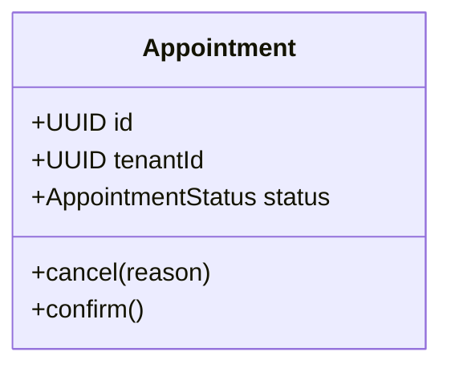

# Specification: {Feature Name}

**Status**: DRAFT | APPROVED | IMPLEMENTED
**Author**: {name}
**Date**: {YYYY-MM-DD}
**Task**: T-{NNN} (`tasks.json`)
**Branch**: `feature/T-{NNN}-{short-name}`
**Relates to**: {UC-01 | UC-02 | UC-03 | UC-04 | transversal}
**ADRs referenced**: {ADR-NNN, ADR-NNN}

---

## 1. Business Goal

One paragraph. Why does this feature exist? What problem does it solve for
the clinic or patient? Map to a use case or business rule.

---

## 2. Functional Requirements

Numbered list. Each item must be independently verifiable.

- FR-01: {The system must...}
- FR-02: {The system must...}
- FR-03: {The system must...}

---

## 3. Non-Functional Requirements

- NFR-01: Response time — {e.g. p95 < 300ms under normal load}
- NFR-02: Security — {e.g. endpoint requires APPOINTMENT_CREATE permission}
- NFR-03: Multitenancy — {all data scoped to tenant_id; no cross-tenant leakage}
- NFR-04: {any other: availability, auditability, data retention}

---

## 4. Acceptance Criteria

Each criterion maps directly to one or more test cases (TC-XX).

- AC-01: Given {context}, when {action}, then {outcome}
- AC-02: Given {context}, when {action}, then {outcome}
- AC-03: Given {context}, when {action}, then {outcome}

---

## 5. Edge Cases

Scenarios that diverge from the happy path and must be explicitly handled:

- EC-01: {description} → expected behavior
- EC-02: {description} → expected behavior
- EC-03: {description} → expected behavior

---

## 6. Constraints

Technical or business limits that bound the implementation:

- {e.g. Must use existing Slot entity — no new table}
- {e.g. Coverage counter update must be atomic with appointment creation}
- {e.g. Must not call external service synchronously — use async job}

---

## 7. Dependencies

| Dependency | Type | Notes |
|---|---|---|
| {Module/Service} | Internal | {how it's used} |
| {FHIR Resource} | Domain | {Patient, Appointment, etc.} |
| {External API} | External | {e.g. WhatsApp Business API} |
| {Migration V{N}} | DB | {table/column being added} |

---

## 8. Risks

- R-01: {Risk description} — Mitigation: {mitigation}
- R-02: {Risk description} — Mitigation: {mitigation}

---

## 9. Open Questions

Questions that must be resolved before implementation starts.
**Do not begin coding while any question is open.**

- OQ-01: {question} — Owner: {person} — Due: {date}
- OQ-02: {question} — Owner: {person} — Due: {date}

Mark resolved questions: ~~OQ-01~~ → Resolved: {answer} ({date})

---

## 10. Domain Design Notes

Entities, value objects, aggregates, and state machines affected.
Add Mermaid diagram if the domain model is non-trivial.



---

## 11. Test Cases

Derived from Acceptance Criteria. These become the test method names.

| ID | Maps to | Type | Description |
|---|---|---|---|
| TC-01 | AC-01 | Unit | {method_givenCondition_expectedBehavior} |
| TC-02 | AC-02 | Integration | {controller test description} |
| TC-03 | AC-03 | Integration | Tenant isolation — only returns tenant-owned records |
| TC-04 | EC-01 | Unit | {edge case test description} |

---

## 12. API Contract (if applicable)

```
{HTTP Method} {path}

Request headers:
  Authorization: Bearer <token>
  X-Tenant-ID: <uuid>

Request body:
{
    "field": "type — constraint"
}

Success response: {status code}
{
    "field": "type"
}

Error responses:
  {status} — {errorCode} — {trigger condition}
  {status} — {errorCode} — {trigger condition}
```
