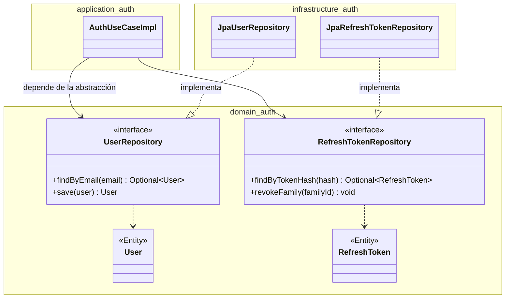
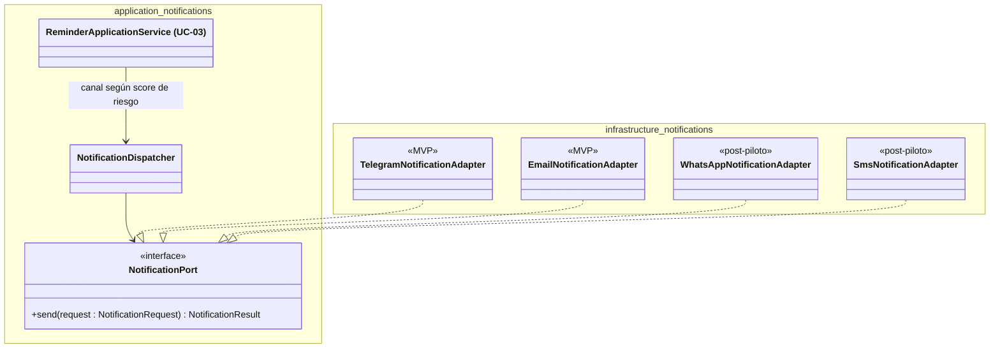
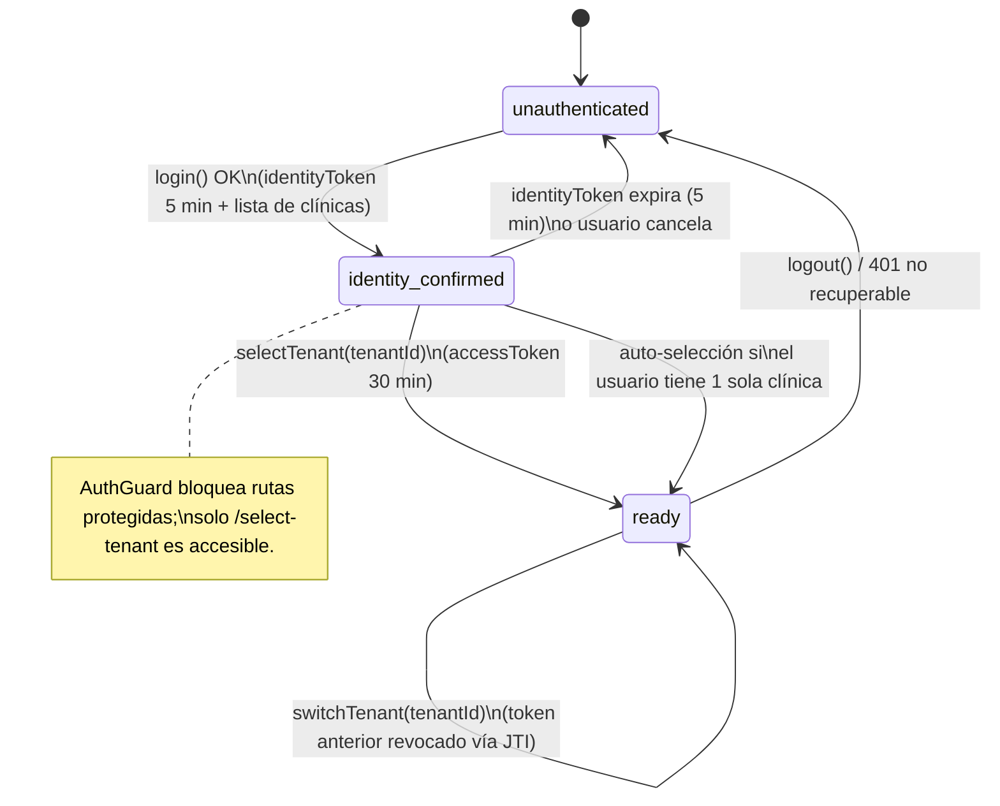

# Patrones de Diseño Aplicados — ClinicaSaaS

**Entrega T-020 — deliverable 9 — Seminario de Trabajo Final UAI 2026**
**Diagrama de arquitectura asociado**: `seminario/iconix/diagramas/07-arquitectura.mmd`

Este documento describe **tres patrones de diseño** aplicados en ClinicaSaaS
(el mínimo solicitado es dos; se documenta uno adicional como margen).
Cada patrón se justifica contra un problema concreto del sistema, no de
forma genérica.

**Estado de implementación — convención de honestidad académica**:

| Etiqueta | Significado |
|---|---|
| `IMPLEMENTADO` | Código existente y verificable en el repositorio a la fecha (2026-06-10). |
| `DISEÑADO` | Definido en spec/ADR aprobado o en borrador; la implementación está planificada en el cronograma del MVP pero aún no existe código. |

A la fecha, el backend Spring Boot contiene únicamente el scaffold
(`ClinicaSaasApplication.java` y `config/SecurityConfig.java`); el frontend
Angular tiene implementado el flujo de autenticación two-step (T-002).
Esta distinción se mantiene explícita en cada patrón.

---

## 1. Repository

### Nombre y clasificación

**Repository** — patrón arquitectural de acceso a datos. No pertenece al
catálogo GoF; proviene de *Patterns of Enterprise Application Architecture*
(Fowler, 2002) y es un bloque constructivo táctico de *Domain-Driven Design*
(Evans, 2003). En ClinicaSaaS se aplica como parte de la regla de
dependencia de Clean Architecture (ADR-010).

### Problema que resuelve en ClinicaSaaS

Los casos de uso del núcleo (UC-01 reservar turno, UC-02 consulta médica,
y el flujo de autenticación T-003) contienen reglas de negocio que deben
poder testearse **sin levantar Spring ni una base de datos**: validación
de tope semanal de obra social, rotación de refresh tokens, detección de
reutilización de tokens. Si la capa de aplicación dependiera directamente
de Spring Data JPA, cada test unitario requeriría un contexto Spring y una
base PostgreSQL, y la lógica de persistencia quedaría acoplada a las reglas
de negocio. Además, en un sistema multitenant con aislamiento por
`tenant_id`, centralizar el acceso a datos en repositorios es lo que
permite garantizar que **toda** query tenant-scoped incluya el filtro de
tenant (anti-patrón prohibido en `CLAUDE.md`: "consulta sin `tenant_id`
en repository").

### Solución aplicada — `DISEÑADO` (spec T-003 en DRAFT; backend aún en scaffold)

Las **interfaces** de repositorio viven en la capa de dominio y las
**implementaciones** JPA en infraestructura. Según la sección 8 de
`docs/specifications/T-003-auth-jwt.spec.md` (branch `feature/T-003-auth-jwt`):

- `domain/auth/UserRepository.java` — interfaz (identidad global, ADR-014)
- `domain/auth/UserTenantRepository.java` — interfaz (membresía usuario×clínica)
- `domain/auth/RefreshTokenRepository.java` — interfaz (rotación single-use, ADR-006)
- `infrastructure/auth/JpaUserRepository.java` — implementa `UserRepository`
- `infrastructure/auth/JpaUserTenantRepository.java` — implementa `UserTenantRepository`
- `infrastructure/auth/JpaRefreshTokenRepository.java` — implementa `RefreshTokenRepository`

La capa de aplicación (`application/auth/AuthUseCaseImpl.java`) depende
solo de las interfaces de dominio; Spring inyecta la implementación JPA
en runtime (inversión de dependencias).



### Consecuencias / trade-offs

**Positivas**:
- Casos de uso testeables en tests unitarios puros (sin Spring, sin BD) —
  objetivo explícito de ADR-010.
- La infraestructura es intercambiable (ej.: cambiar la estrategia de
  persistencia) sin tocar reglas de negocio.
- Punto único donde imponer el filtro `tenant_id` en queries.

**Negativas** (asumidas en ADR-010):
- Más clases que un MVC de 3 capas: una operación de reserva atraviesa
  5–6 clases en lugar de 2.
- Riesgo de sobre-ingeniería en CRUD simple; ADR-010 documenta como
  excepción aceptada el acceso directo service → repository para
  endpoints de pura gestión de datos (alta de tenant, admin de usuarios).

### Referencia

- ADR: `docs/adr/ADR-010-clean-architecture.md` (ACCEPTED)
- Spec: `docs/specifications/T-003-auth-jwt.spec.md`, sección 8 (DRAFT,
  en branch `feature/T-003-auth-jwt`)
- Estructura de capas: `docs/architecture/01-high-level-architecture.md`, §3

---

## 2. Strategy / Puertos y Adaptadores (canales de notificación)

### Nombre y clasificación

**Strategy** — patrón de comportamiento del catálogo GoF (Gamma et al.,
1994): familia de algoritmos intercambiables encapsulados tras una interfaz
común. En ClinicaSaaS se materializa con la forma arquitectural de
**Puertos y Adaptadores** (arquitectura hexagonal, Cockburn 2005): el
puerto se declara hacia el dominio y los adaptadores concretos viven en
infraestructura. Ambas lecturas son válidas y complementarias; la
intención dominante es Strategy (elegir el canal en runtime).

### Problema que resuelve en ClinicaSaaS

UC-03 (predicción de ausentismo) exige enviar recordatorios a pacientes
por **canales distintos según el score de riesgo**. El canal óptimo para
Argentina es WhatsApp, pero WhatsApp Business API requiere aprobación de
Meta (días a semanas), costo por conversación (~USD 0,05) y número
verificado — inviable para el piloto del seminario. Telegram Bot API es
gratuito e inmediato, pero tiene menor penetración en el segmento.
La decisión (ADR-013) fue arrancar el MVP con Telegram + email y dejar
WhatsApp/SMS para post-piloto, **sin que la lógica de negocio de UC-03
tenga que cambiar al agregar canales**. Hardcodear Telegram en el servicio
habría obligado a un refactor al incorporar WhatsApp.

### Solución aplicada — `DISEÑADO` (ADR-013 ACCEPTED; implementación planificada con T-009/UC-03)

La capa de aplicación llama a un puerto sin conocer el canal concreto:

- `application/notifications/NotificationPort.java` — interfaz (puerto)
- `application/notifications/NotificationRequest.java` — record: destinatario, mensaje, canal, prioridad
- `application/notifications/NotificationResult.java` — record: éxito/fallo, messageId, timestamp
- `infrastructure/notifications/TelegramNotificationAdapter.java` — MVP (riesgo alto/medio)
- `infrastructure/notifications/EmailNotificationAdapter.java` — MVP (todos los riesgos)
- `infrastructure/notifications/WhatsAppNotificationAdapter.java` — post-piloto
- `infrastructure/notifications/SmsNotificationAdapter.java` — post-piloto
- `infrastructure/notifications/NotificationDispatcher.java` — selecciona el adaptador según canal

La **regla de selección de canal por score de riesgo** queda en el
Application Service de UC-03 (decisión de negocio), no en los adaptadores
(decisión técnica de entrega).



### Consecuencias / trade-offs

**Positivas** (ADR-013):
- El piloto arranca el día 1 sin aprobaciones externas ni costo variable.
- Agregar WhatsApp en producción = un nuevo Adapter + credenciales; cero
  cambios en la lógica de negocio de UC-03.
- Cada adaptador es testeable en aislamiento con mocks.

**Negativas** (asumidas explícitamente en ADR-013):
- Telegram no es el canal dominante en el segmento médico adulto
  argentino; el piloto puede tener menor tasa de respuesta.
- Limitación del modelo de bots de Telegram: el paciente debe iniciar la
  conversación con el bot primero — se mitiga documentándolo en el
  onboarding de la clínica piloto.
- Una capa extra de indirección (`Dispatcher`) frente a llamar al cliente
  Telegram directamente; se justifica por el roadmap multi-canal real.

### Referencia

- ADR: `docs/adr/ADR-013-notification-channels.md` (ACCEPTED)
- Caso de uso: CU-03 — `.claude/tasks/use-cases.md`
- Arquitectura: `docs/architecture/01-high-level-architecture.md`, §3 (infrastructure/notifications)

---

## 3. State (máquina de estados de autenticación two-step)

### Nombre y clasificación

**State** — patrón de comportamiento del catálogo GoF: el comportamiento
de un objeto cambia según su estado interno, y las transiciones válidas
están definidas de forma explícita. En ClinicaSaaS se aplica en su
**variante ligera** idiomática de Angular moderno: el estado se modela
como unión discriminada (`type AuthState`) dentro de un Signal reactivo,
en lugar de una clase por estado como en la formulación GoF clásica.
Esta variante se elige deliberadamente: tres estados con transiciones
simples no justifican el costo de un objeto por estado (regla del
proyecto: ninguna abstracción sin justificar su complejidad).

### Problema que resuelve en ClinicaSaaS

ADR-014 separa identidad de membresía: una persona (ej. un médico con dos
consultorios, una secretaria compartida) tiene **una cuenta y varias
clínicas**. El login pasa a ser de dos pasos: primero se prueba la
identidad (token de identidad, 5 min), después se elige la clínica (token
de sesión con `tenant_id` y `role`). Entre ambos pasos el usuario está
"a medio autenticar": no puede acceder a rutas protegidas, pero tampoco
es un anónimo. Sin estados explícitos, los guards de rutas tendrían que
inferir esta situación de la presencia/ausencia de tokens sueltos —
frágil y propenso a estados inválidos (ej.: acceder a `/select-tenant`
sin haber hecho login).

### Solución aplicada — `IMPLEMENTADO` (frontend, T-002)

`src/frontend/src/app/core/auth/auth.service.ts` (código existente):

```typescript
/** Estados del flujo de autenticación two-step (ADR-014). */
export type AuthState = 'unauthenticated' | 'identity_confirmed' | 'ready';

readonly authState = signal<AuthState>('unauthenticated');
```

Transiciones implementadas en `AuthService`:
- `login()` exitoso → `identity_confirmed` (guarda `identityToken` en
  memoria y la lista de clínicas); si hay una sola clínica, encadena
  `selectTenant()` automáticamente.
- `selectTenant()` → `ready` (descarta el token de identidad, guarda el
  `accessToken` y el tenant activo).
- `switchTenant()` → permanece en `ready` con nuevo contexto de tenant
  (flag `isSwitchingTenant` evita que un 401 en vuelo dispare logout).
- `logout()` / `clearState()` → `unauthenticated`.

Los guards consumen el estado, no los tokens:
- `auth.guard.ts` exige `authState === 'ready'`.
- `select-tenant.guard.ts` exige `identity_confirmed` (la ruta
  `/select-tenant` es inaccesible en cualquier otro estado).



**Segunda aplicación del mismo patrón — `DISEÑADO`**: los ciclos de vida
de UC-02 son dos máquinas de estado separadas *(decisión 2026-06-10)* —
Turno (FHIR `Appointment`): `reservado → confirmado → llegó → cumplido /
ausente`; ConsultaMedica (FHIR `Encounter`): `en curso → finalizada` —
con transiciones inválidas rechazadas por el dominio, usando la misma
técnica de máquina de estados explícita; se documentarán con su
implementación en la fase de historia clínica del cronograma.

### Consecuencias / trade-offs

**Positivas**:
- Estados inválidos irrepresentables: los guards deciden por estado
  explícito, no por inspección de tokens.
- El Signal propaga el cambio de estado reactivamente a navbar, guards y
  layout sin suscripciones manuales.
- El costo de un paso extra de login para usuarios multi-clínica se
  elimina para el caso mayoritario (una clínica) con la auto-selección.

**Negativas / límites**:
- Variante ligera: las transiciones se validan implícitamente por el flujo
  de llamadas, no por un objeto por estado que rechace transiciones
  ilegales en compilación — aceptable con 3 estados, a revisar si el
  flujo crece (ej.: MFA agregaría un cuarto estado).
- Estado en memoria (NFR-03: ningún token en localStorage): un refresh de
  página vuelve a `unauthenticated` y requiere el flujo de refresh token
  (cookie httpOnly) para recuperar la sesión — diseño pendiente en T-003.

### Referencia

- ADR: `docs/adr/ADR-014-multi-tenant-membership.md` (ACCEPTED, §"Frontend state machine")
- Código: `src/frontend/src/app/core/auth/auth.service.ts`,
  `src/frontend/src/app/core/auth/auth.guard.ts`,
  `src/frontend/src/app/core/auth/select-tenant.guard.ts` (branch de T-002)
- Spec: `docs/specifications/T-002-scaffold-frontend.spec.md`

---

## Resumen

| # | Patrón | Clasificación | Ámbito | Estado |
|---|---|---|---|---|
| 1 | Repository | Arquitectural (PoEAA / DDD) | Backend — persistencia auth y dominio | DISEÑADO (T-003 DRAFT) |
| 2 | Strategy / Ports & Adapters | GoF comportamiento + hexagonal | Backend — notificaciones UC-03 | DISEÑADO (ADR-013 ACCEPTED) |
| 3 | State | GoF comportamiento (variante ligera) | Frontend — auth two-step | IMPLEMENTADO (T-002) |

Patrón adicional presente en el diseño y no documentado en detalle aquí:
**Chain of Responsibility** en la cadena de filtros de Spring Security
(`RateLimitFilter → JwtAuthenticationFilter → TenantContextFilter`),
provisto por el framework y configurado en `SecurityConfig.java`.
