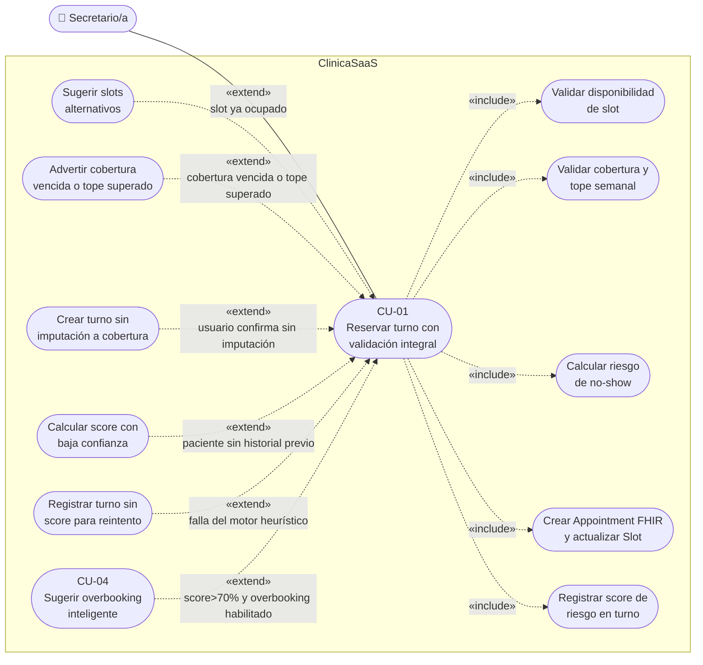

# CU-01 — Reservar turno (Casos de Uso)

```mermaid
flowchart LR
    SEC(["👤 Secretario/a"])

    subgraph SYS["ClinicaSaaS"]
        direction TB
        UC01(["CU-01\nReservar turno con\nvalidación integral"])
        UC_DISP(["Validar disponibilidad\nde slot"])
        UC_COB(["Validar cobertura y\ntope semanal"])
        UC_RIESGO(["Calcular riesgo\nde no-show"])
        UC_APPT(["Crear Appointment FHIR\ny actualizar Slot"])
        UC_SCORE(["Registrar score de\nriesgo en turno"])
        UC_ALT(["Sugerir slots\nalternativos"])
        UC_ADV_COB(["Advertir cobertura\nvencida o tope superado"])
        UC_SIN_COB(["Crear turno sin\nimputación a cobertura"])
        UC_BAJA_CONF(["Calcular score con\nbaja confianza"])
        UC_RETRY(["Registrar turno sin\nscore para reintento"])
        UC04(["CU-04\nSugerir overbooking\ninteligente"])
    end

    SEC --- UC01

    UC01 -.->|«include»| UC_DISP
    UC01 -.->|«include»| UC_COB
    UC01 -.->|«include»| UC_RIESGO
    UC01 -.->|«include»| UC_APPT
    UC01 -.->|«include»| UC_SCORE

    UC_ALT       -.->|"«extend»\nslot ya ocupado"| UC01
    UC_ADV_COB   -.->|"«extend»\ncobertura vencida o tope superado"| UC01
    UC_SIN_COB   -.->|"«extend»\nusuario confirma sin imputación"| UC01
    UC_BAJA_CONF -.->|"«extend»\npaciente sin historial previo"| UC01
    UC_RETRY     -.->|"«extend»\nfalla del motor heurístico"| UC01
    UC04         -.->|"«extend»\nscore>70% y overbooking habilitado"| UC01
```
