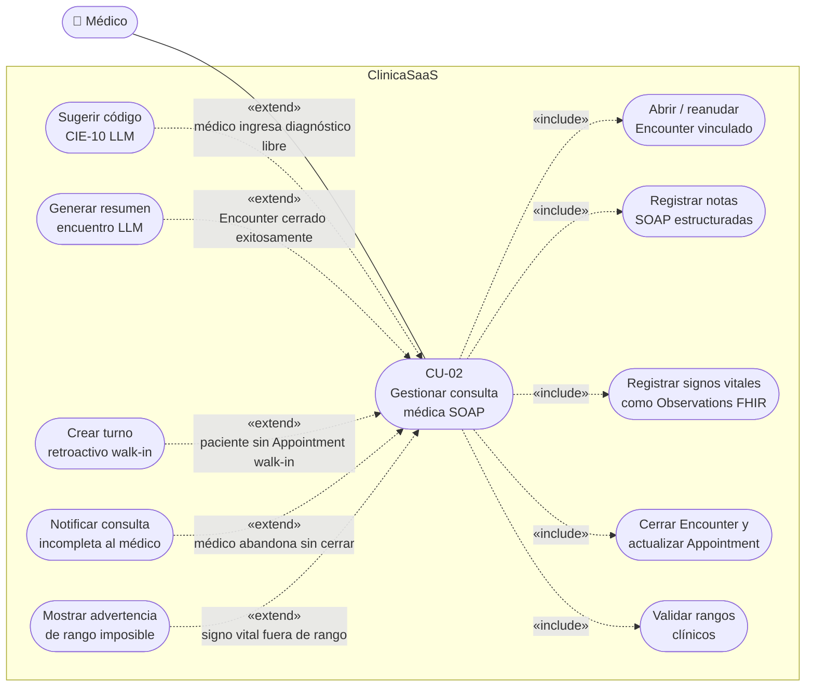

# CU-02 — Consulta médica SOAP (Casos de Uso)

```mermaid
flowchart LR
    MED(["👤 Médico"])

    subgraph SYS["ClinicaSaaS"]
        direction TB
        UC02(["CU-02\nGestionar consulta\nmédica SOAP"])
        UC_OPEN(["Abrir / reanudar\nEncounter vinculado"])
        UC_SOAP(["Registrar notas\nSOAP estructuradas"])
        UC_OBS(["Registrar signos vitales\ncomo Observations FHIR"])
        UC_CLOSE(["Cerrar Encounter y\nactualizar Appointment"])
        UC_RANG(["Validar rangos\nclínicos"])
        UC_CIE10(["Sugerir código\nCIE-10 LLM"])
        UC_LLM(["Generar resumen\nencuentro LLM"])
        UC_WALKIN(["Crear turno\nretroactivo walk-in"])
        UC_INCOMP(["Notificar consulta\nincompleta al médico"])
        UC_WARN(["Mostrar advertencia\nde rango imposible"])
    end

    MED --- UC02

    UC02 -.->|«include»| UC_OPEN
    UC02 -.->|«include»| UC_SOAP
    UC02 -.->|«include»| UC_OBS
    UC02 -.->|«include»| UC_CLOSE
    UC02 -.->|«include»| UC_RANG

    UC_CIE10  -.->|"«extend»\nmédico ingresa diagnóstico libre"| UC02
    UC_LLM    -.->|"«extend»\nEncounter cerrado exitosamente"| UC02
    UC_WALKIN -.->|"«extend»\npaciente sin Appointment walk-in"| UC02
    UC_INCOMP -.->|"«extend»\nmédico abandona sin cerrar"| UC02
    UC_WARN   -.->|"«extend»\nsigno vital fuera de rango"| UC02
```
