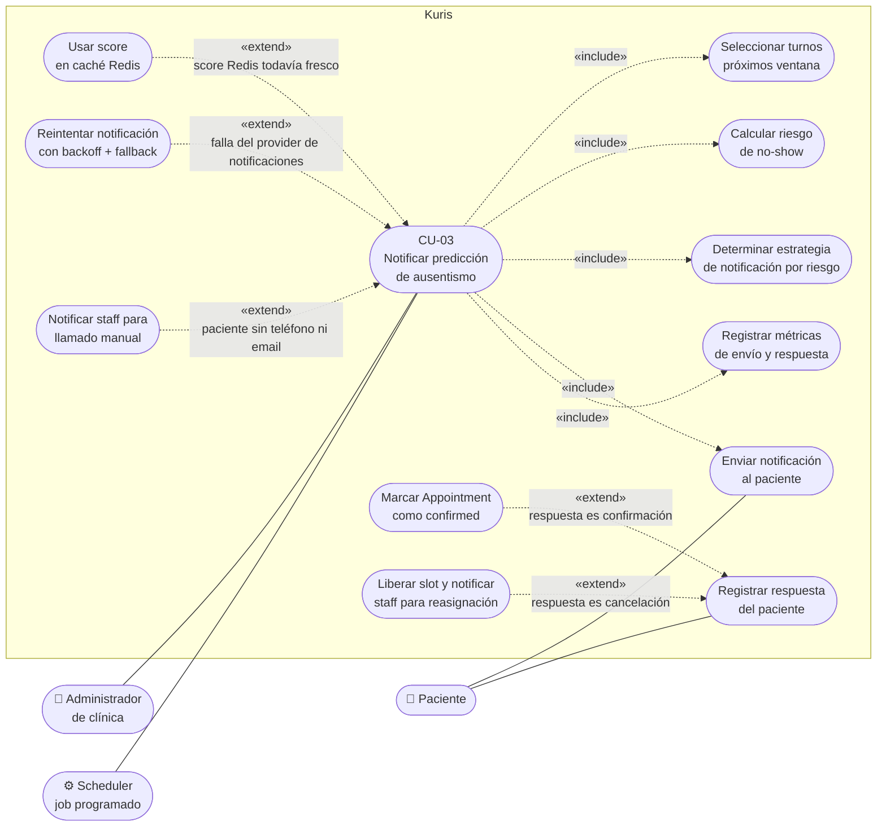

# CU-03 — Predicción de ausentismo (Casos de Uso)

```mermaid
flowchart LR
    ADM(["👤 Administrador\nde clínica"])
    SCH(["⚙️ Scheduler\njob programado"])
    PAC(["👤 Paciente"])

    subgraph SYS["Kuris"]
        direction TB
        UC03(["CU-03\nNotificar predicción\nde ausentismo"])
        UC_SEL(["Seleccionar turnos\npróximos ventana"])
        UC_RIESGO(["Calcular riesgo\nde no-show"])
        UC_STRAT(["Determinar estrategia\nde notificación por riesgo"])
        UC_NOTIF(["Enviar notificación\nal paciente"])
        UC_RESP(["Registrar respuesta\ndel paciente"])
        UC_METR(["Registrar métricas\nde envío y respuesta"])
        UC_CACHE(["Usar score\nen caché Redis"])
        UC_RETRY3(["Reintentar notificación\ncon backoff + fallback"])
        UC_STAFF(["Notificar staff para\nllamado manual"])
        UC_CONFIRM(["Marcar Appointment\ncomo confirmed"])
        UC_REASIG(["Liberar slot y notificar\nstaff para reasignación"])
    end

    ADM --- UC03
    SCH --- UC03
    PAC --- UC_NOTIF
    PAC --- UC_RESP

    UC03 -.->|«include»| UC_SEL
    UC03 -.->|«include»| UC_RIESGO
    UC03 -.->|«include»| UC_STRAT
    UC03 -.->|«include»| UC_NOTIF
    UC03 -.->|«include»| UC_METR

    UC_CACHE  -.->|"«extend»\nscore Redis todavía fresco"| UC03
    UC_RETRY3 -.->|"«extend»\nfalla del provider de notificaciones"| UC03
    UC_STAFF  -.->|"«extend»\npaciente sin teléfono ni email"| UC03
    UC_CONFIRM -.->|"«extend»\nrespuesta es confirmación"| UC_RESP
    UC_REASIG  -.->|"«extend»\nrespuesta es cancelación"| UC_RESP
```
