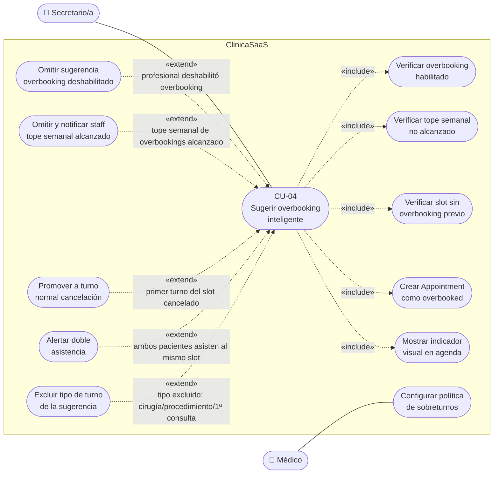

# CU-04 — Overbooking inteligente (Casos de Uso)

```mermaid
flowchart LR
    SEC(["👤 Secretario/a"])
    MED(["👤 Médico"])

    subgraph SYS["ClinicaSaaS"]
        direction TB
        UC04(["CU-04\nSugerir overbooking\ninteligente"])
        UC_OVB_HAB(["Verificar overbooking\nhabilitado"])
        UC_OVB_TOP(["Verificar tope semanal\nno alcanzado"])
        UC_OVB_DUP(["Verificar slot sin\noverbooking previo"])
        UC_OVB_APPT(["Crear Appointment\ncomo overbooked"])
        UC_OVB_UI(["Mostrar indicador\nvisual en agenda"])
        UC_CFG_OVB2(["Configurar política\nde sobreturnos"])
        UC_OVB_DIS(["Omitir sugerencia\noverbooking deshabilitado"])
        UC_OVB_MAX(["Omitir y notificar staff\ntope semanal alcanzado"])
        UC_OVB_PROM(["Promover a turno\nnormal cancelación"])
        UC_OVB_ALERT(["Alertar doble\nasistencia"])
        UC_OVB_EXCL(["Excluir tipo de turno\nde la sugerencia"])
    end

    SEC --- UC04
    MED --- UC_CFG_OVB2

    UC04 -.->|«include»| UC_OVB_HAB
    UC04 -.->|«include»| UC_OVB_TOP
    UC04 -.->|«include»| UC_OVB_DUP
    UC04 -.->|«include»| UC_OVB_APPT
    UC04 -.->|«include»| UC_OVB_UI

    UC_OVB_DIS   -.->|"«extend»\nprofesional deshabilitó overbooking"| UC04
    UC_OVB_MAX   -.->|"«extend»\ntope semanal de overbookings alcanzado"| UC04
    UC_OVB_PROM  -.->|"«extend»\nprimer turno del slot cancelado"| UC04
    UC_OVB_ALERT -.->|"«extend»\nambos pacientes asisten al mismo slot"| UC04
    UC_OVB_EXCL  -.->|"«extend»\ntipo excluido: cirugía/procedimiento/1ª consulta"| UC04
```
