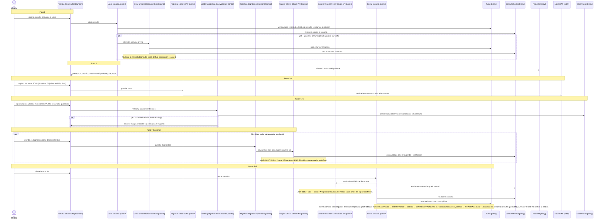

# Robustez CU-02

CU-02: Gestionar consulta médica (SOAP básico).

```mermaid
sequenceDiagram
    %% Trazabilidad:
    %% Paso 1 → Medico -> UI ; UI -> ABR ; ABR -> TUR ; ABR -> CON
    %% Paso 2 → ABR -> PAC ; ABR -> UI «presenta la consulta»
    %% Pasos 3-4 → Medico -> UI «SOAP» ; UI -> NOT ; NOT -> NOTA
    %% Pasos 5-6 → Medico -> UI «signos vitales» ; UI -> VOBS ; VOBS -> OBS
    %% Paso 7 → (opt) Medico -> UI ; UI -> DIAG ; DIAG -> LLM_CIE ; LLM_CIE -> CON
    %% Pasos 8-9 → Medico -> UI «cierra» ; UI -> CIE ; CIE -> LLM_RES ; LLM_RES -> CON ; CIE -> CON ; CIE -> TUR
    actor Medico as Médico
    participant UI as Pantalla de consulta [boundary]
    participant ABR as Abrir consulta [control]
    participant WALK as Crear turno retroactivo walk-in [control]
    participant NOT as Registrar notas SOAP [control]
    participant VOBS as Validar y registrar observaciones [control]
    participant DIAG as Registrar diagnóstico provisorio [control]
    participant LLM_CIE as Sugerir CIE-10 Claude API [control]
    participant LLM_RES as Generar resumen LLM Claude API [control]
    participant CIE as Cerrar consulta [control]
    participant TUR as Turno [entity]
    participant CON as ConsultaMedica [entity]
    participant PAC as Paciente [entity]
    participant NOTA as NotaSOAP [entity]
    participant OBS as Observacion [entity]

    Note over Medico,UI: Paso 1
    Medico->>UI: abre la consulta vinculada al turno
    UI->>ABR: abrir consulta
    ABR->>TUR: verifica turno en estado «llegó» (o consulta «en curso» a retomar)
    ABR->>CON: recupera o inicia la consulta

    alt A3 — paciente sin turno previo (walk-in, CU-S09)
        ABR->>WALK: atención sin turno previo
        WALK->>TUR: crea el turno retroactivo
        WALK->>CON: crea la consulta «walk-in»
        Note over WALK: Mantiene la integridad consulta–turno. El flujo continúa en el paso 2.
    end

    Note over ABR,UI: Paso 2
    ABR->>PAC: obtiene los datos del paciente
    ABR->>UI: presenta la consulta con datos del paciente y del turno

    Note over Medico,NOTA: Pasos 3–4
    Medico->>UI: registra las notas SOAP (Subjetivo, Objetivo, Análisis, Plan)
    UI->>NOT: guardar notas
    NOT->>NOTA: persiste las notas asociadas a la consulta

    Note over Medico,OBS: Pasos 5–6
    Medico->>UI: registra signos vitales y mediciones (TA, FC, peso, talla, glucemia)
    UI->>VOBS: validar y guardar mediciones
    VOBS->>OBS: almacena las observaciones asociadas a la consulta

    alt A2 — valores clínicos fuera de rango
        VOBS->>UI: advierte rangos imposibles (no bloquea el registro)
    end

    Note over Medico,LLM_CIE: Paso 7 (opcional)
    opt el médico registra diagnóstico provisorio
        Medico->>UI: escribe el diagnóstico como descripción libre
        UI->>DIAG: guardar diagnóstico
        DIAG->>LLM_CIE: enviar texto libre para sugerencia CIE-10
        LLM_CIE->>CON: asocia código CIE-10 sugerido + justificación
        Note over LLM_CIE: ADR-012 / T-018 — Claude API sugiere CIE-10. El médico conserva el criterio final.
    end

    Note over Medico,TUR: Pasos 8–9
    Medico->>UI: cierra la consulta
    UI->>CIE: cerrar consulta
    CIE->>LLM_RES: enviar datos FHIR del Encounter
    LLM_RES->>CON: asocia resumen en lenguaje natural
    Note over LLM_RES: ADR-012 / T-017 — Claude API genera resumen. El médico valida antes del registro definitivo.
    CIE->>CON: finaliza la consulta
    CIE->>TUR: marca el turno como «cumplido»

    Note over CIE,TUR: Cierre atómico. Dos máquinas de estado separadas (ADR-016):\n· Turno: RESERVADO → CONFIRMADO → LLEGÓ → CUMPLIDO / AUSENTE.\n· ConsultaMedica: EN_CURSO → FINALIZADA.\nA1 — abandono sin cerrar: la consulta queda EN_CURSO y el sistema notifica al médico.
```
