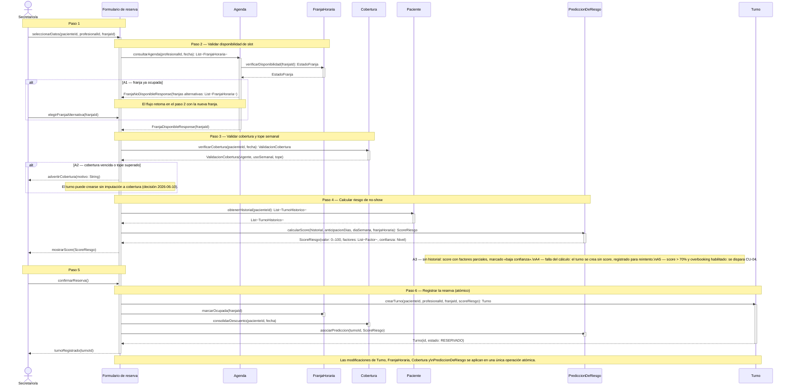

# Secuencia CU-01

CU-01: Reservar turno con validación integral.

```mermaid
sequenceDiagram
    actor Secretario as Secretario/a
    participant UI as Formulario de reserva
    participant Agenda as Agenda
    participant FranjaHoraria as FranjaHoraria
    participant Cobertura as Cobertura
    participant Paciente as Paciente
    participant PrediccionDeRiesgo as PrediccionDeRiesgo
    participant Turno as Turno

    Note over Secretario,UI: Paso 1
    Secretario->>UI: seleccionarDatos(pacienteId, profesionalId, franjaId)
    activate UI

    Note over UI,FranjaHoraria: Paso 2 — Validar disponibilidad de slot
    UI->>Agenda: consultarAgenda(profesionalId, fecha): List~FranjaHoraria~
    activate Agenda
    Agenda->>FranjaHoraria: verificarDisponibilidad(franjaId): EstadoFranja
    activate FranjaHoraria
    FranjaHoraria-->>Agenda: EstadoFranja
    deactivate FranjaHoraria

    alt A1 — franja ya ocupada
        Agenda-->>UI: FranjaNoDisponibleResponse(franjas alternativas: List~FranjaHoraria~)
        Note over UI,Agenda: El flujo retoma en el paso 2 con la nueva franja.
        Secretario->>UI: elegirFranjaAlternativa(franjaId)
    end

    Agenda-->>UI: FranjaDisponibleResponse(franjaId)
    deactivate Agenda

    Note over UI,Cobertura: Paso 3 — Validar cobertura y tope semanal
    UI->>Cobertura: verificarCobertura(pacienteId, fecha): ValidacionCobertura
    activate Cobertura
    Cobertura-->>UI: ValidacionCobertura(vigente, usoSemanal, tope)
    deactivate Cobertura

    alt A2 — cobertura vencida o tope superado
        UI-->>Secretario: advertirCobertura(motivo: String)
        Note over UI: El turno puede crearse sin imputación a cobertura (decisión 2026-06-10).
    end

    Note over UI,PrediccionDeRiesgo: Paso 4 — Calcular riesgo de no-show
    UI->>Paciente: obtenerHistorial(pacienteId): List~TurnoHistorico~
    activate Paciente
    Paciente-->>UI: List~TurnoHistorico~
    deactivate Paciente
    UI->>PrediccionDeRiesgo: calcularScore(historial, anticipacionDias, diaSemana, franjaHoraria): ScoreRiesgo
    activate PrediccionDeRiesgo
    PrediccionDeRiesgo-->>UI: ScoreRiesgo(valor: 0–100, factores: List~Factor~, confianza: Nivel)
    deactivate PrediccionDeRiesgo
    UI-->>Secretario: mostrarScore(ScoreRiesgo)

    Note over PrediccionDeRiesgo: A3 — sin historial: score con factores parciales, marcado «baja confianza».\nA4 — falla del cálculo: el turno se crea sin score, registrado para reintento.\nA5 — score > 70% y overbooking habilitado: se dispara CU-04.

    Note over Secretario,UI: Paso 5
    Secretario->>UI: confirmarReserva()

    Note over UI,Turno: Paso 6 — Registrar la reserva (atómico)
    UI->>Turno: crearTurno(pacienteId, profesionalId, franjaId, scoreRiesgo): Turno
    activate Turno
    UI->>FranjaHoraria: marcarOcupada(franjaId)
    activate FranjaHoraria
    deactivate FranjaHoraria
    UI->>Cobertura: consolidarDescuento(pacienteId, fecha)
    activate Cobertura
    deactivate Cobertura
    UI->>PrediccionDeRiesgo: asociarPrediccion(turnoId, ScoreRiesgo)
    activate PrediccionDeRiesgo
    deactivate PrediccionDeRiesgo
    Turno-->>UI: Turno(id, estado: RESERVADO)
    deactivate Turno
    UI-->>Secretario: turnoRegistrado(turnoId)
    deactivate UI

    Note over UI,Turno: Las modificaciones de Turno, FranjaHoraria, Cobertura y\nPrediccionDeRiesgo se aplican en una única operación atómica.
```
