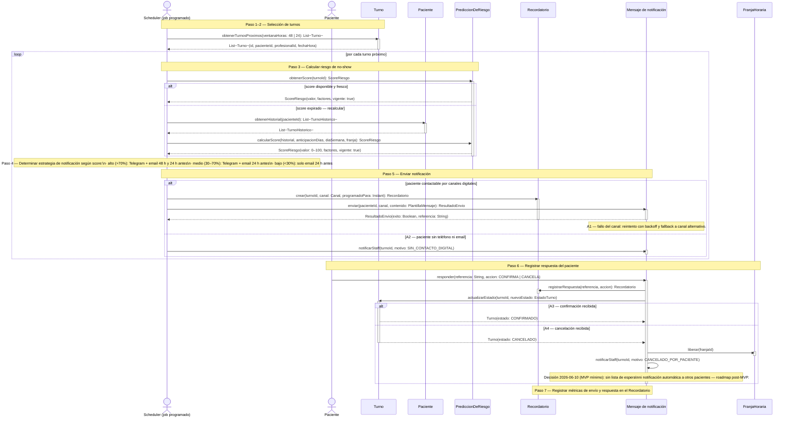

# Secuencia CU-03

CU-03: Calcular y notificar predicción de ausentismo.

```mermaid
sequenceDiagram
    actor Scheduler as Scheduler (job programado)
    actor PacienteActor as Paciente
    participant Turno as Turno
    participant Paciente as Paciente
    participant PrediccionDeRiesgo as PrediccionDeRiesgo
    participant Recordatorio as Recordatorio
    participant MensajeNotificacion as Mensaje de notificación
    participant FranjaHoraria as FranjaHoraria

    Note over Scheduler,Turno: Paso 1–2 — Selección de turnos
    Scheduler->>Turno: obtenerTurnosProximos(ventanaHoras: 48 | 24): List~Turno~
    activate Turno
    Turno-->>Scheduler: List~Turno~(id, pacienteId, profesionalId, fechaHora)
    deactivate Turno

    loop por cada turno próximo

        Note over Scheduler,PrediccionDeRiesgo: Paso 3 — Calcular riesgo de no-show
        Scheduler->>PrediccionDeRiesgo: obtenerScore(turnoId): ScoreRiesgo
        activate PrediccionDeRiesgo

        alt score disponible y fresco
            PrediccionDeRiesgo-->>Scheduler: ScoreRiesgo(valor, factores, vigente: true)
        else score expirado — recalcular
            Scheduler->>Paciente: obtenerHistorial(pacienteId): List~TurnoHistorico~
            activate Paciente
            Paciente-->>Scheduler: List~TurnoHistorico~
            deactivate Paciente
            Scheduler->>PrediccionDeRiesgo: calcularScore(historial, anticipacionDias, diaSemana, franja): ScoreRiesgo
            PrediccionDeRiesgo-->>Scheduler: ScoreRiesgo(valor: 0–100, factores, vigente: true)
        end

        deactivate PrediccionDeRiesgo

        Note over Scheduler: Paso 4 — Determinar estrategia de notificación según score:\n· alto (>70%): Telegram + email 48 h y 24 h antes\n· medio (30–70%): Telegram + email 24 h antes\n· bajo (<30%): solo email 24 h antes

        Note over Scheduler,MensajeNotificacion: Paso 5 — Enviar notificación
        alt paciente contactable por canales digitales
            Scheduler->>Recordatorio: crear(turnoId, canal: Canal, programadoPara: Instant): Recordatorio
            activate Recordatorio
            Scheduler->>MensajeNotificacion: enviar(pacienteId, canal, contenido: PlantillaMensaje): ResultadoEnvio
            activate MensajeNotificacion
            MensajeNotificacion-->>Scheduler: ResultadoEnvio(exito: Boolean, referencia: String)
            deactivate MensajeNotificacion
            deactivate Recordatorio
            Note over MensajeNotificacion: A1 — fallo del canal: reintento con backoff y fallback a canal alternativo.
        else A2 — paciente sin teléfono ni email
            Scheduler->>MensajeNotificacion: notificarStaff(turnoId, motivo: SIN_CONTACTO_DIGITAL)
            activate MensajeNotificacion
            deactivate MensajeNotificacion
        end

    end

    Note over PacienteActor,FranjaHoraria: Paso 6 — Registrar respuesta del paciente
    PacienteActor->>MensajeNotificacion: responder(referencia: String, accion: CONFIRMA | CANCELA)
    activate MensajeNotificacion
    MensajeNotificacion->>Recordatorio: registrarRespuesta(referencia, accion): Recordatorio
    activate Recordatorio
    deactivate Recordatorio
    MensajeNotificacion->>Turno: actualizarEstado(turnoId, nuevoEstado: EstadoTurno)
    activate Turno

    alt A3 — confirmación recibida
        Turno-->>MensajeNotificacion: Turno(estado: CONFIRMADO)
    else A4 — cancelación recibida
        Turno-->>MensajeNotificacion: Turno(estado: CANCELADO)
        deactivate Turno
        MensajeNotificacion->>FranjaHoraria: liberar(franjaId)
        activate FranjaHoraria
        deactivate FranjaHoraria
        MensajeNotificacion->>MensajeNotificacion: notificarStaff(turnoId, motivo: CANCELADO_POR_PACIENTE)
        Note over MensajeNotificacion: Decisión 2026-06-10 (MVP mínimo): sin lista de espera\nni notificación automática a otros pacientes — roadmap post-MVP.
    end

    deactivate MensajeNotificacion

    Note over MensajeNotificacion,Recordatorio: Paso 7 — Registrar métricas de envío y respuesta en el Recordatorio
```
