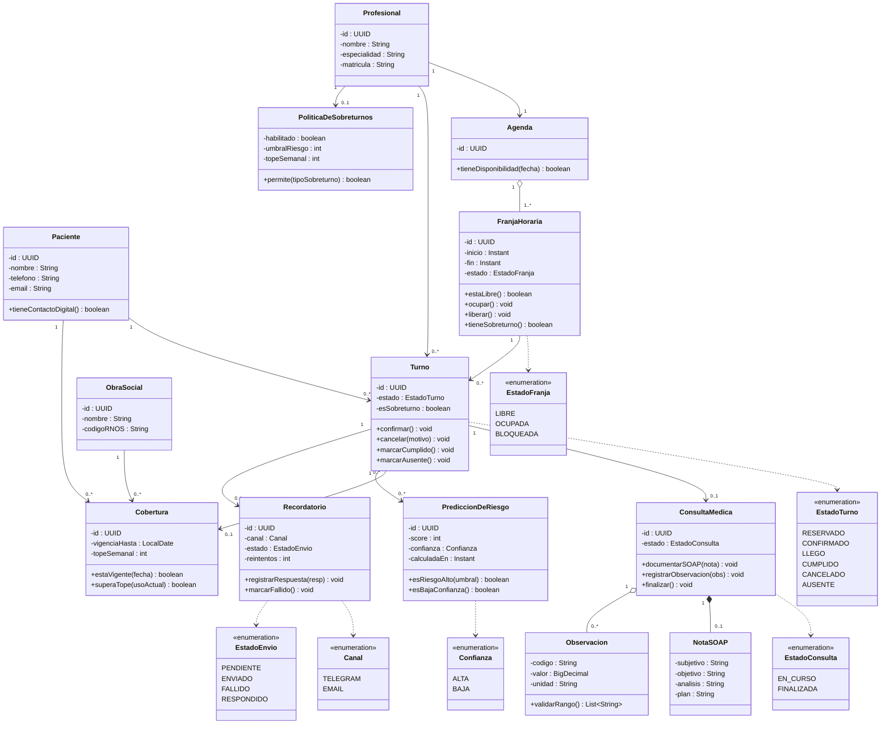

# Clases de Dominio

Diagrama de clases del dominio (ICONIX).

```mermaid
classDiagram
    direction TB

    %% ── Estilos ──────────────────────────────────────────────────
    classDef entity   fill:#FFFDE8,stroke:#AAAA00,color:#000
    classDef valueObj fill:#E8F4FF,stroke:#4488CC,color:#000
    classDef enumDef  fill:#FFF5CC,stroke:#CCAA00,color:#000

    %% ══════════════════════════════════════════════════════════════
    %% ENTIDADES DE DOMINIO
    %% ══════════════════════════════════════════════════════════════

    class Paciente {
        -id : UUID
        -nombre : String
        -telefono : String
        -email : String
        +tieneContactoDigital() boolean
    }

    class Profesional {
        -id : UUID
        -nombre : String
        -especialidad : String
        -matricula : String
    }

    class Agenda {
        -id : UUID
        +tieneDisponibilidad(fecha) boolean
    }

    class FranjaHoraria {
        -id : UUID
        -inicio : Instant
        -fin : Instant
        -estado : EstadoFranja
        +estaLibre() boolean
        +ocupar() void
        +liberar() void
        +tieneSobreturno() boolean
    }

    class Turno {
        -id : UUID
        -estado : EstadoTurno
        -esSobreturno : boolean
        +confirmar() void
        +cancelar(motivo) void
        +marcarCumplido() void
        +marcarAusente() void
    }

    class ConsultaMedica {
        -id : UUID
        -estado : EstadoConsulta
        +documentarSOAP(nota) void
        +registrarObservacion(obs) void
        +finalizar() void
    }

    class NotaSOAP {
        -subjetivo : String
        -objetivo : String
        -analisis : String
        -plan : String
    }

    class Observacion {
        -codigo : String
        -valor : BigDecimal
        -unidad : String
        +validarRango() List~String~
    }

    class ObraSocial {
        -id : UUID
        -nombre : String
        -codigoRNOS : String
    }

    class Cobertura {
        -id : UUID
        -vigenciaHasta : LocalDate
        -topeSemanal : int
        +estaVigente(fecha) boolean
        +superaTope(usoActual) boolean
    }

    class PrediccionDeRiesgo {
        -id : UUID
        -score : int
        -confianza : Confianza
        -calculadaEn : Instant
        +esRiesgoAlto(umbral) boolean
        +esBajaConfianza() boolean
    }

    class Recordatorio {
        -id : UUID
        -canal : Canal
        -estado : EstadoEnvio
        -reintentos : int
        +registrarRespuesta(resp) void
        +marcarFallido() void
    }

    class PoliticaDeSobreturnos {
        -habilitado : boolean
        -umbralRiesgo : int
        -topeSemanal : int
        +permite(tipoSobreturno) boolean
    }

    %% ══════════════════════════════════════════════════════════════
    %% ENUMERACIONES
    %% ══════════════════════════════════════════════════════════════

    class EstadoTurno {
        <<enumeration>>
        RESERVADO
        CONFIRMADO
        LLEGO
        CUMPLIDO
        CANCELADO
        AUSENTE
    }

    class EstadoConsulta {
        <<enumeration>>
        EN_CURSO
        FINALIZADA
    }

    class EstadoFranja {
        <<enumeration>>
        LIBRE
        OCUPADA
        BLOQUEADA
    }

    class Canal {
        <<enumeration>>
        TELEGRAM
        EMAIL
    }

    class Confianza {
        <<enumeration>>
        ALTA
        BAJA
    }

    class EstadoEnvio {
        <<enumeration>>
        PENDIENTE
        ENVIADO
        FALLIDO
        RESPONDIDO
    }

    %% ══════════════════════════════════════════════════════════════
    %% ASIGNACIÓN DE ESTILOS
    %% ══════════════════════════════════════════════════════════════
    class Paciente:::entity
    class Profesional:::entity
    class Agenda:::entity
    class FranjaHoraria:::entity
    class Turno:::entity
    class ConsultaMedica:::entity
    class NotaSOAP:::valueObj
    class Observacion:::valueObj
    class ObraSocial:::entity
    class Cobertura:::entity
    class PrediccionDeRiesgo:::entity
    class Recordatorio:::entity
    class PoliticaDeSobreturnos:::valueObj

    class EstadoTurno:::enumDef
    class EstadoConsulta:::enumDef
    class EstadoFranja:::enumDef
    class Canal:::enumDef
    class Confianza:::enumDef
    class EstadoEnvio:::enumDef

    %% ══════════════════════════════════════════════════════════════
    %% RELACIONES
    %% ══════════════════════════════════════════════════════════════

    %% Uso de enumeraciones
    Turno ..> EstadoTurno
    ConsultaMedica ..> EstadoConsulta
    FranjaHoraria ..> EstadoFranja
    Recordatorio ..> Canal
    Recordatorio ..> EstadoEnvio
    PrediccionDeRiesgo ..> Confianza

    %% Estructura de agenda
    Profesional "1" --> "1" Agenda
    Agenda "1" o-- "1..*" FranjaHoraria
    FranjaHoraria "1" --> "0..*" Turno

    %% Participantes del turno
    Paciente "1" --> "0..*" Turno
    Profesional "1" --> "0..*" Turno

    %% Política de sobreturnos
    Profesional "1" --> "0..1" PoliticaDeSobreturnos

    %% Consulta médica
    Turno "1" --> "0..1" ConsultaMedica
    ConsultaMedica "1" *-- "0..1" NotaSOAP
    ConsultaMedica "1" o-- "0..*" Observacion

    %% Cobertura / obra social
    ObraSocial "1" --> "0..*" Cobertura
    Paciente "1" --> "0..*" Cobertura
    Turno "0..*" --> "0..1" Cobertura

    %% Predicción y notificaciones
    Turno "1" --> "0..*" PrediccionDeRiesgo
    Turno "1" --> "0..*" Recordatorio
```
